## Updating PCDA Materials with GitHub Desktop

Download [GitHub Desktop](https://desktop.github.com/).

Open GitHub Desktop and log in with your account. Click the '+' on the upper left to create or download (clone)  a project. Select 'pcda' and click 'Clone pcda.'

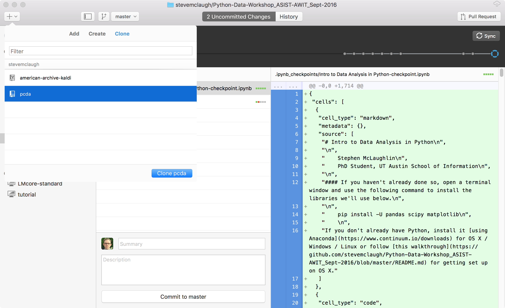

Save the project somewhere on your system.

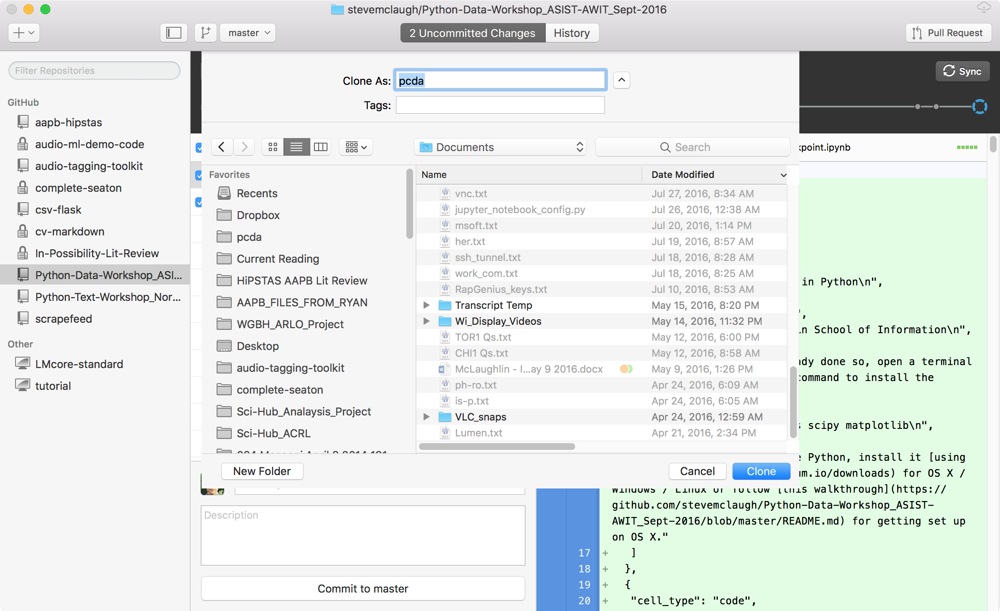

The client will take a moment to download.

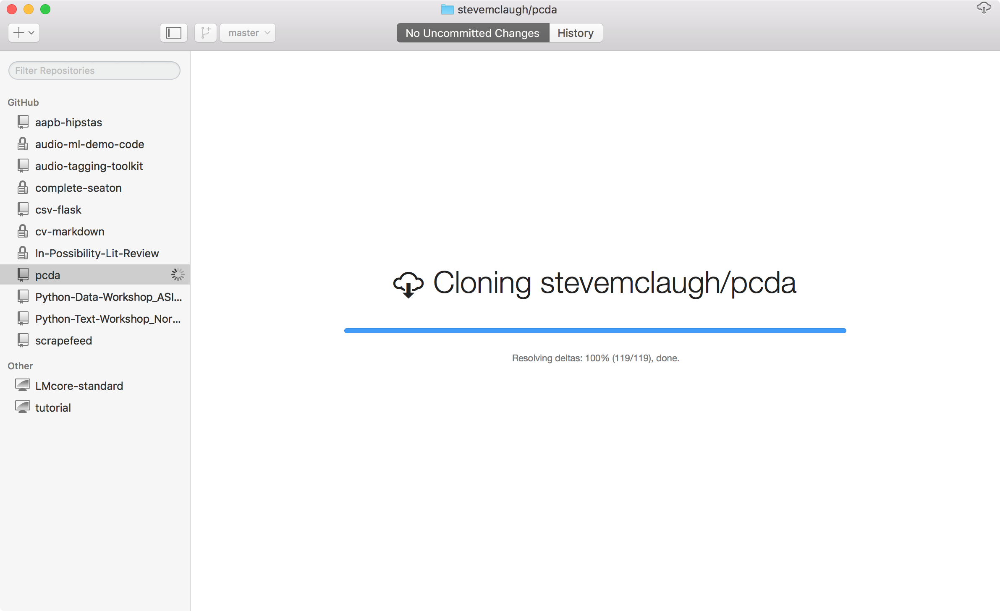

When it's done you'll see a log of past project edits.

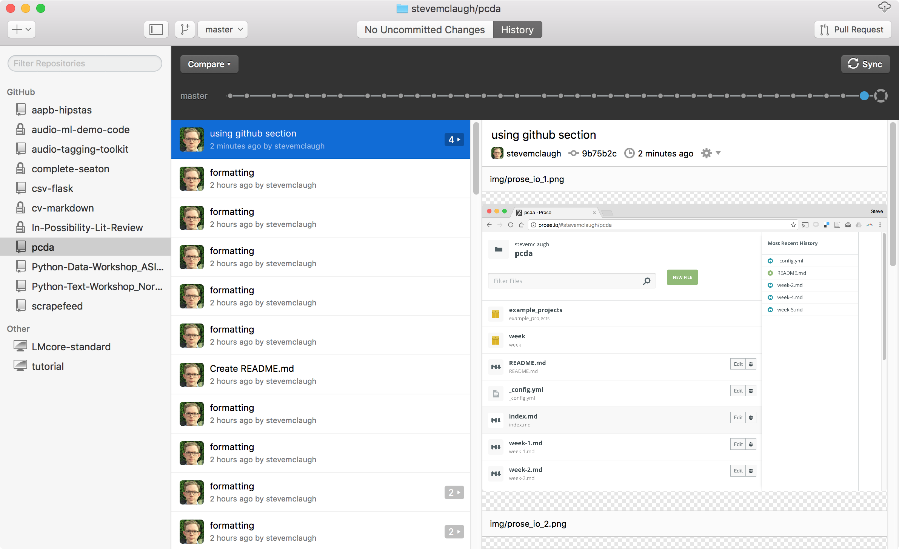

Click 'No Uncommitted Changes' at the top to see the interface you'll spend most of your time in. Since we haven't made any changes yet, everything is blank.

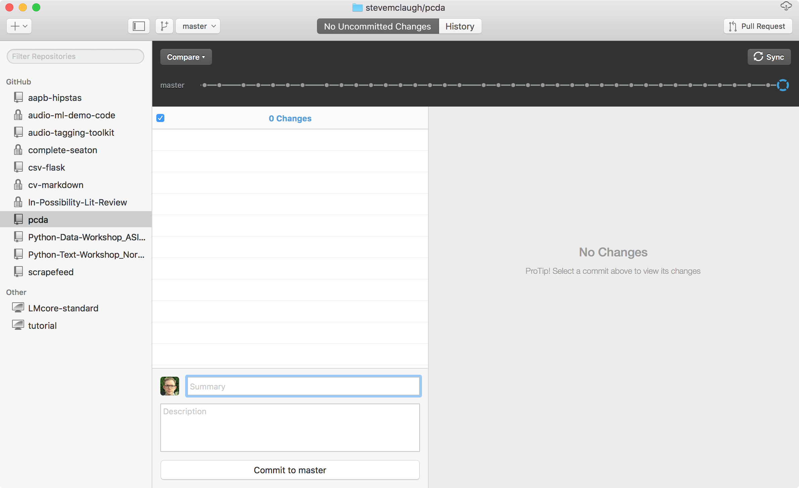

Navigate to your project directory and open a text file. Each page is in Markdown format, which has almost no learning curve. Here's a [quick reference](https://github.com/adam-p/markdown-here/wiki/Markdown-Cheatsheet) I like.

Any plaintext editor will do; I'm using [Typora](https://typora.io/), which displays Markdown nicely.

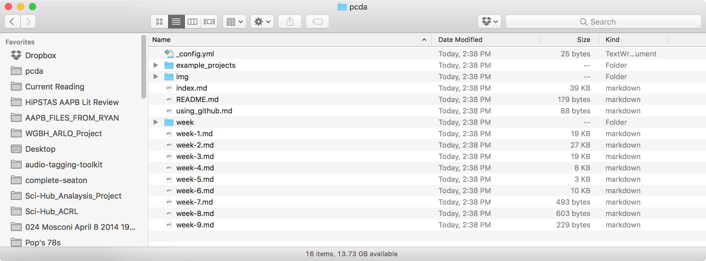

Make an edit and save the file.

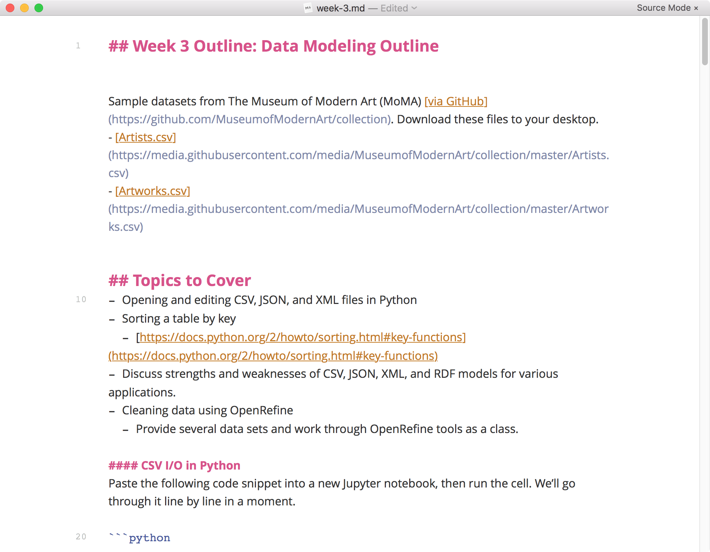

Return to GitHub Desktop and you'll a list of updated files. Briefly describe your changes in the text box on the lower left, then click 'Commit to master' to save your state.

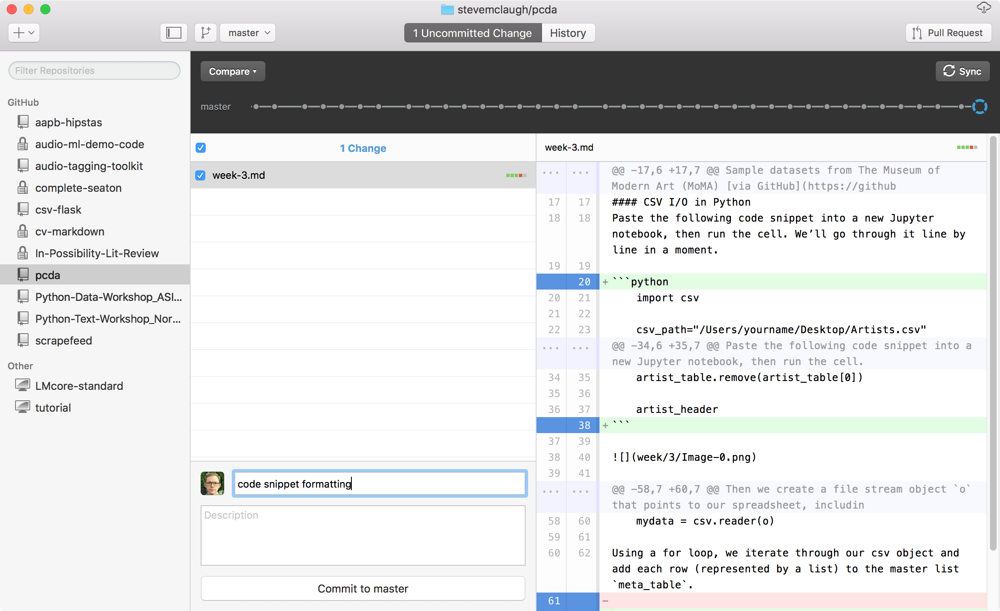

Finally, click "Sync" in the upper right to upload your changes to GitHub.

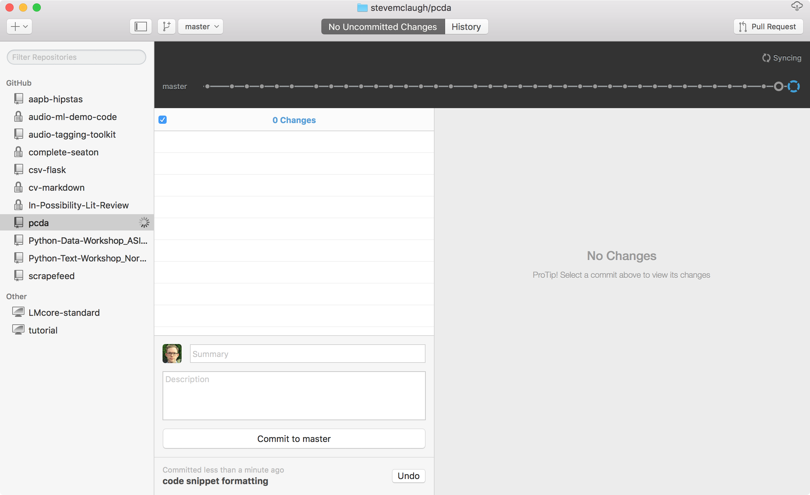

The PCDA syllabus is currently visible at [https://stevemclaugh.github.io/pcda/](https://stevemclaugh.github.io/pcda/).

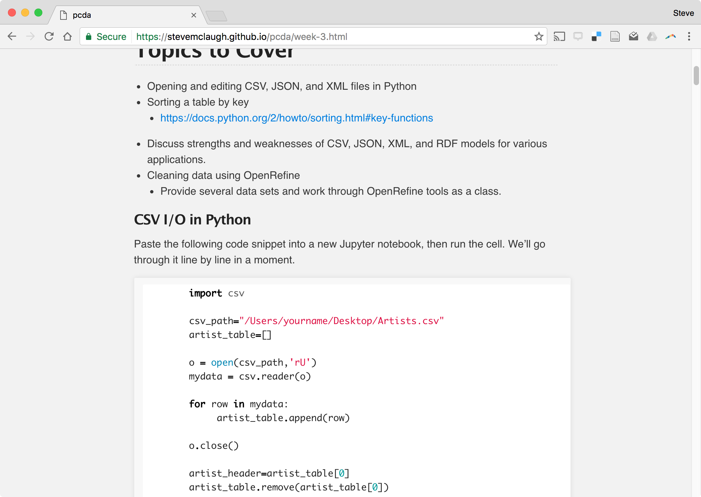

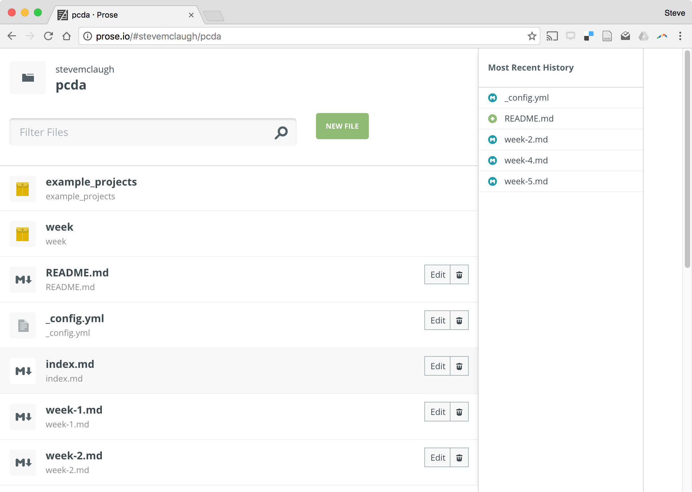

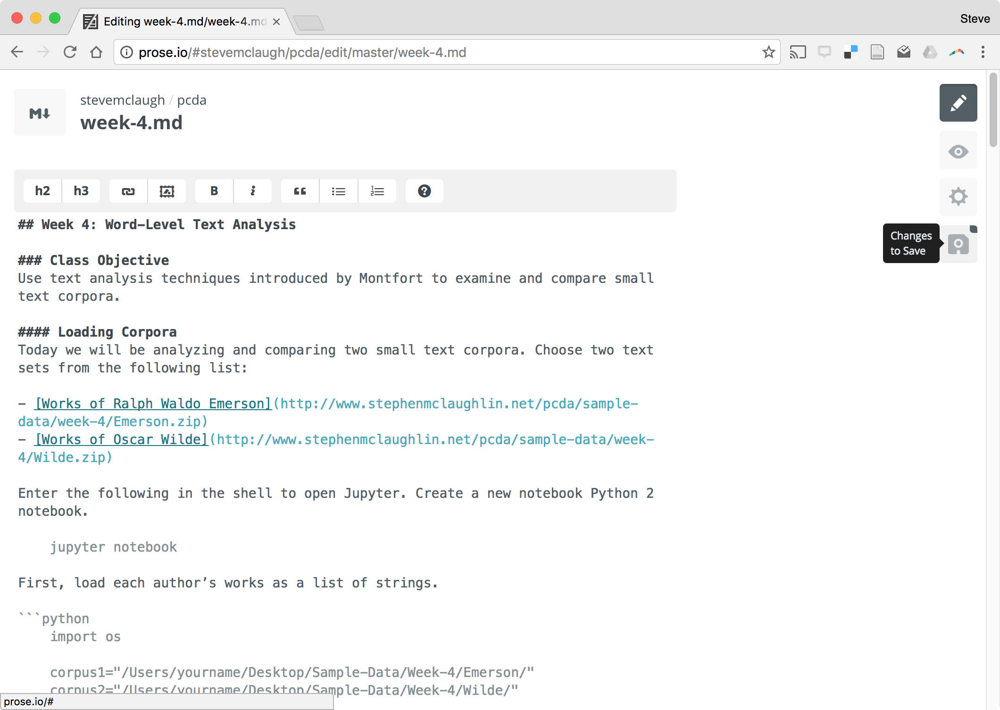

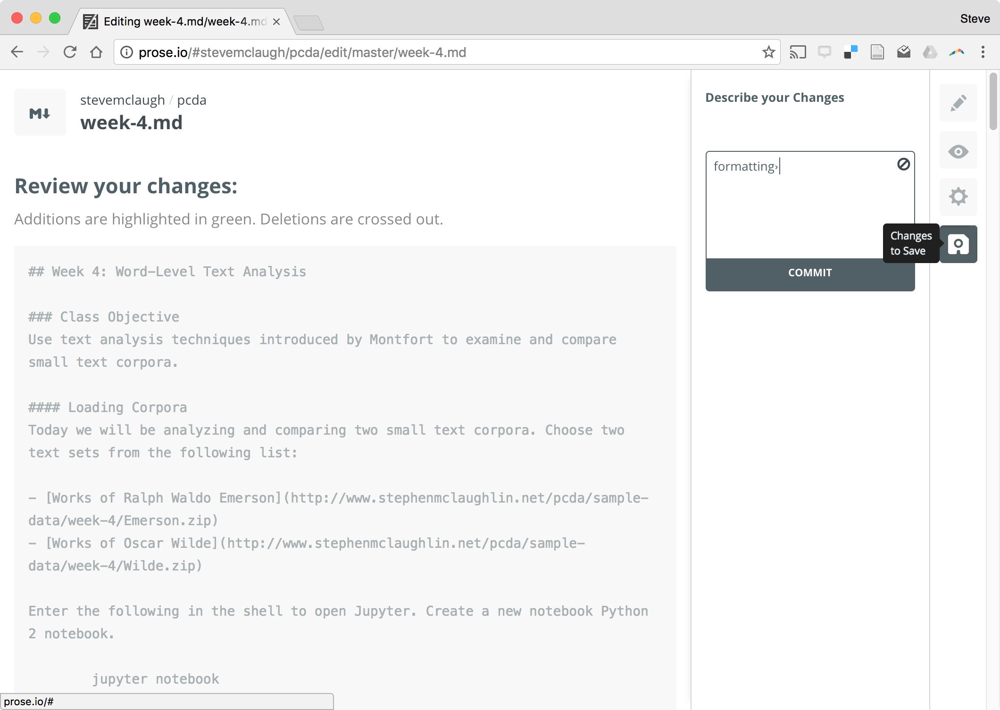

