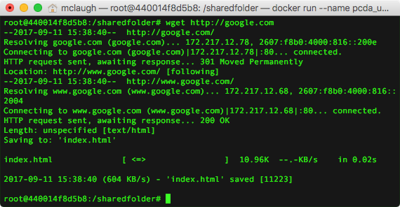
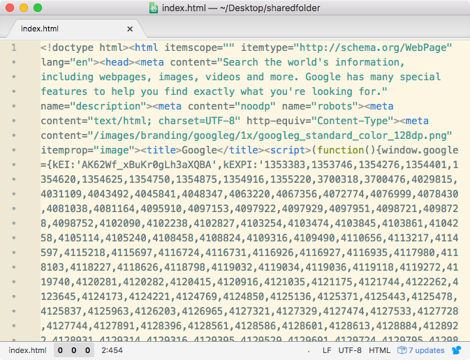
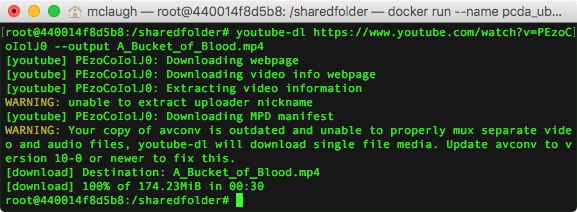
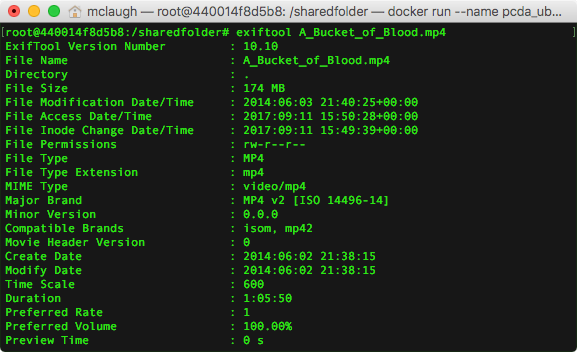
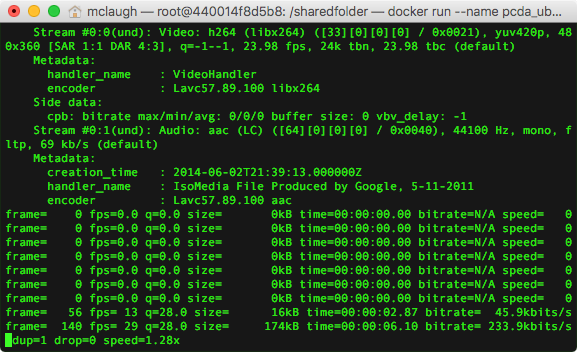

## Week 1 Outline: Introductions & Command Line Basics

## Software to install before class

- Text editor: Atom or Geany
    - https://atom.io
    - https://www.geany.org

- Docker CE or Docker Toolbox
    - [Docker CE](https://store.docker.com/search?type=edition&offering=community) (macOS/Linux)
    - [Docker Toolbox](https://www.docker.com/products/docker-toolbox) (Windows)


#### Introductions


#### Command Line Basics

While the terms “command line,” “terminal,” and “shell” are sometimes used interchangeably, each has a slightly different denotation.

“**Command line**” has the broadest scope, referring to a style of interface. A command-line interface, also known as a command-line interpreter (CLI) is any system in which all interaction occurs via text-based commands issued through a keyboard.

A **terminal**, or more accurately a terminal emulator, is an application in your local operating system that simply provides a window to type in. We’ll be using the built-in macOS terminal emulator, called **Terminal**, which you can find under “Utilities” in your Applications folder (`/Applications/Utilities/Terminal.app`). Open Terminal, then type the following and press return. (Note that there is a space after `echo`.)

    echo $SHELL

A **shell** is the software layer between user input and the rote world of file system maintenance. The graphical user interface (GUI) provided by Mac OS X is itself technically considered a shell, but if someone refers to “the shell” they typically mean a command-line interpreter like [Bash](#). The command you entered above should have returned something like `/bin/bash`, which is the location of Bash’s “binary,” or machine-readable application file. If you open a command-line session on a remote server, your text input will be handled by the shell installed on that server.

It’s important to understand that both Mac’s GUI (known as [Aqua](#)) and Bash are rooted in the same set of underlying OS services. Since the introduction of OS X, and now in iOS as well, these core utilities have been handled by a Unix-like operating system called [Darwin](#), which is based on the famously stable [Berkeley Software Distribution (BSD)](#) Unix clone.


#### Exploring the File System

While we wait for Python to install, let’s learn about interacting with the Mac file system from the shell. Create a new terminal window by pressing ⌘+N. Before we go further, you may find it helpful to pull up the following cheat sheet: [Unix/Linux Command Reference](http://cc.iiti.ac.in/lcommands.pdf).

Unix-like operating systems are based on a metaphor: a nested set of directories and data files, forming a tree structure that begins at the root directory `/`. A benefit of this arrangement is that each file can be uniquely identified using a pathname of the following format:`/Users/yourname/Desktop/file.txt`.

At any given moment in a shell session, the user metaphorically occupies a particular “working directory” within this greater tree structure. Enter the `pwd` (“print working directory”) command to see your current location.

    pwd

The root directory, `/`, is just like any other folder in the system. Enter the following to change your working directory to root.

    cd /

You can view the contents of the current directory with the `ls` command.

    ls


You should see a list of directories including “Library,” “Users,” “bin,” “dev” and so on. Add the `-a` option and you’ll see a longer list that may include hidden files beginning with `.`. You can find dozens of other options in the `ls` manual, which you can read using the following line. Press “q” to return to the shell.

    #[Note: Ignore this until our class Docker container is ready.]
    man ls

> **Tip:** Hold down the Option key and click within the current line to move the cursor.

#### Command Line Basics Continued
Next, let’s create a new directory and brief text file in our shared folder. We’ll spend more time working with text after the break.

```bash
cd /sharedfolder
mkdir test_dir
echo "This is some text." > test.txt
```

To move our text document into our directory we can use the `mv` tool. We’ll then `cd` into the folder.

    mv test.txt test_dir
    cd test_dir

> **Tip:** `cd` interprets `test_dir` as a relative file path in the above lines. Because a folder with that names is indeed present in the working directory, we can refer to it by its local name rather than its full pathname beginning with `/`.

Let’s make a copy of our text file with `cp` and check the updated directory contents.

    cp test.txt test2.txt
    ls

> **Tip:** If you’re midway through typing the name of a pre-existing file in the shell, you can press tab to compete the name automatically.

Let’s rename our new text file using `mv` then check the change with `ls`. Then we’ll delete the file with `rm`.

    mv test2.txt test3.txt
    ls
    rm test3.txt

Another useful file path shortcut is `../`, which refers to the parent directory of our current location on the file tree. Let’s use it to `cd` back to Desktop.

    cd ../

Finally, we’ll delete our test directory and the file inside. Adding the `-r` option tells `rm`  to remove files recursively, meaning everything in the specified folder gets wiped out.

    rm -r test_dir

Be careful with `rm`, especially in recursive mode. It deletes files permanently rather than sending them to a Trash folder, so a small mistake can really ruin your day.


#### Text I/O from the Command Line

Below, we create a text file in the Desktop directory using the `>` operator. We then append a second line using `>>` and view the contents of Desktop to confirm we’ve made a new file.

> **Tip:** If `>` is directed at an existing file, it will overwrite the original without warning.

    cd /sharedfolder
    echo "Hello there." > note.txt
    echo "Hello again." >> note.txt
    ls

If we want to view our new text file, we have lots of options to choose from. By default, **head** will read the first 10 lines of a text file and print them in the shell. You can specify any number of lines with the `-n` option.

    head note.txt
    head -n 1 note.txt


**tail** is similar, printing a file’s final lines instead.

    tail note.txt
    tail -n 1 note.txt

**less** is a program that lets us scroll through longer files. To close less when you’re finished, press the `q` key.

    less note.txt


**Nano** is a simple text editor that is available in most Unix-like systems.

    nano note.txt


Use the arrow keys to move your cursor around in the document. Add another line to the file and save it by pressing `ctrl+O` (the letter 'O'), followed by `return` to confirm the filename. Press `ctrl+X` to exit Nano.


#### Break


#### Up and running with Docker

Open a new terminal window:

- macOS: Open the application `Terminal`, located in `/Applications/Utilities`.
- Windows: Double click `Docker Quickstart Terminal` on your desktop.
- Linux: Press `Ctrl+Alt+T` to launch a terminal window.


Now enter the following command to download the pre-built Docker image we'll be using. This should take 2 or 3 minutes.

```
docker pull pcda17/ubuntu-container
```

When the download is complete, enter the following to run the container. This will create a new directory called `sharedfolder` on your desktop.

```
docker run -it --name pcda_ubuntu -v ~/Desktop/sharedfolder/:/sharedfolder/ pcda17/ubuntu-container
```

>For future, reference, the following command will kill the container we just created.
>```
>docker rm -f pcda_ubuntu
>```

You should now be in an interactive terminal session in your new Ubuntu image. To make sure, enter the following command to check your username; the response should be `root`.

```
whoami
```

Now `cd` to the directory `/sharedfolder` in your Ubuntu image and create a new text file.

```
cd /sharedfolder

echo "Some text" > sample_file.txt
```

On your desktop, open the directory `sharedfolder`. You should see the file we just created, `sample_file.txt`. The `sharedfolder` directory is a shared volume between the Docker Ubuntu image and our local OS, meaning both can read and write files located there.


#### Download a Web page from the shell
Begin by `cd`ing to `sharedfolder`.

    cd /sharedfolder

Let's install `wget` using the `apt` package manager.

    apt-get install -y wget

Now enter `wget` followed by any URL.

    wget http://google.com



If you’re connected to the Internet and Wget is installed correctly, you should see feedback in the shell that looks something like the above. In this case, Wget has saved Google’s “index.html” file to the desktop. Either view the file in the shell using `less` or open it in TextWrangler.



To make the file more readable in TextWrangler, go to the toolbar and select `View > Text Display > Soft Wrap Text`.

Wget is an amazingly versatile tool, and we’ll return to it in later weeks. In the meantime, the manual is worth a skim.

    man wget

#### Download a video with youtube-dl and create an excerpt with FFmpeg <!-- Note: this takes a while. -->
First, install **youtube-dl** and **FFmpeg** using apt.

    apt-get install youtube-dl
    apt-get install ffmpeg

`cd` to Desktop and pass a YouTube URL to `youtube-dl`. We’ll be downloading _A Bucket of Blood_, Roger Corman’s 1959 black comedy about beatnik culture (which happens to be in the public domain). The file will be around 300 MB, so you can substitute a shorter YouTube video if you’re close to your wi-fi bandwidth limit.

    cd /sharedfolder
    youtube-dl https://www.youtube.com/watch?v=PEzoCoIolJ0



To simplify things, locate the video in Finder and change its name to `Bucket.mp4`. Now let’s look at the file’s metadata with ExifTool.

    exiftool Bucket.mp4



Use the `--help` option to view ExifTool’s man page, which you can also find [here](#). Press `q` to exit the manual viewer.

    exiftool --help

Next, we’ll extract a 90-second segment from the video using [FFmpeg](#). The `-ss` option specifies start time and `-t` is the length of our new excerpt. In this case we’re creating a 90-second clip beginning 10 minutes, 11 seconds into the film.  This may take a few minutes.

    ffmpeg -i Bucket.mp4 -ss 00:10:11.0 -t 00:01:30.0 Bucket_clip.mp4



Instead of HH:MM:SS.S notation, we can also specify start time and/or length using seconds. The following command produces the same output as the one above.

    ffmpeg -i Bucket.mp4 -ss 701 -t 90 Bucket_clip.mp4

To re-encode a video clip when you make an excerpt, you can include the `-c copy` option.

    ffmpeg -i Bucket.mp4 -c copy -ss 00:10:11.0 -t 00:01:30.0 Bucket_clip.mp4

When FFmpeg is finished, open `Bucket_clip.mp4` in VLC Media Player and see how it turned out. You may notice missing video frames or other errors.


As usual, entering `man ffmpeg` will display the program’s manual.


#### Programming basics in Python (as much as time permits)
To get started using Python, simply enter `python` in the shell.

    python

We’ve just switched from the standard shell to the Python environment, which you can tell at a glance by the “\>\>\>” to the left of your cursor. We’re in what’s known as a language shell or a read-eval-print loop (REPL), in which any commands we enter will be interpreted as Python code. You can leave Python at any time by entering the `quit()` command.

We’ll begin by assigning some data to variables.

    x=5
    y=5.0
    z="Hello"

If you type `x` and hit return, you’ll notice the variable’s current value is output on the line below. Trying the same with `x+2` will return 7.

    x+2

> *Output:*
>
>     7

Note that `x+x` gives a result of 10, while `x+y` returns 10.0. That’s because 5 and 5.0 are different data types in Python. The former is an **int**, or integer, while the latter is a **float**, or floating point value.


Now try using the `+` operator on two strings.
    z+" world"

> *Output:*
>
>     'Hello world'

Note that `+` is used for two entirely different purposes: adding numbers and concatenating strings. When the same symbol performs multiple tasks in different contexts, it’s described as overloaded.

By the way, you can use single or double quotes to enclose string text in Python. We’ll talk more about this next week.

Next we’ll link a series of values using Python’s list data type. There several ways to represent an ordered sequence of items in Python, but we’ll be using list most frequently.

    eu_countries=['Austria', 'Belgium', 'Bulgaria', 'Croatia', 'Republic of Cyprus', 'Czech Republic', 'Denmark', 'Estonia', 'Finland', 'France', 'Germany', 'Greece', 'Hungary', 'Ireland', 'Italy', 'Latvia', 'Lithuania', 'Luxembourg', 'Malta', 'Netherlands', 'Poland', 'Portugal', 'Romania', 'Slovakia', 'Slovenia', 'Spain', 'Sweden', 'UK']

We can now refer to individual list members using bracket annotation.

    eu_countries[3]

The command above returns the string “Croatia,” which is located at index 3. As in most programming languages, we begin counting from 0 when working with ordered data.

If you try to access an out-of-range index value you’ll get an error.

    eu_countries[99]

We can also create a subset of a list using Python’s slice notation. The following will return a list containing four items, beginning at index 3 in `eu_countries`.

    eu_countries[3:7]

Leaving one side of the colon blank will include all items on that end of the list.

    eu_countries[5:]
    eu_countries[:10]

We can also use negative numbers to count backwards from the end of a list. The following will return “UK,” the final string in the list.

    eu_countries[-1]

Under the hood, every string in Python is actually a list of individual characters. In the example below, `word[7]` returns the letter “e,” while `word[7:20]` returns “establishment.”

    word="antidisestablishmentarianism"
    word[7]
    word[7:20]

If we need to know the length of a list or string, the `len` function can tell us.

    len(eu_countries)
    len(word)

Conditional statements are a fundamental part of all programming languages. We use the `if` operator to evaluate conditionals.

    number=12
    if number==12:
         print("The value is 12, an integer.")

By adding `else`, we can tell Python to do something if the conditional isn’t true.

    number=10
    if number==12:
         print("The value is 12, an integer.")
    else:
         print("The value is not 12.")

A **for loop** is a structure that lets us iterate through lists and other data structures so we can refer to each item one at a time.

    for country in eu_countries:
        print(country + ' is great.')

Finally, we can create functions to automate repetitive processes. Use the `def` declaration to start s function definition. The code below will produce the same output as the last example.

```python
def is_great(word):
    return word + ' is great.'

for country in eu_countries:
    print(is_great(country))
```

In this case we’re not saving much effort, but as we proceed you’ll find that functions will help you write simpler, more readable code.

#### **11.** Accessing the shell from Python with the `os` package (if time permits)
The next section is intended as an instructor demonstration, to be included if time permits.

First, let’s check the length of the film with `exiftool`. Open a new terminal window and enter the following.
    cd /sharedfolder
    exiftool Bucket.mp4

The file comes to 1:05:57, or 3907 seconds. Lets extract 10 5-second clips at random and combine them to create a new video.

 ```python
import os
import random

total_time=3907
clip_time=5

def random_start():
    return random.random()*(total_time-clip_time)

os.system('cd /Users/yourname/Desktop/')

for i in range(10):
    os.system("ffmpeg -i Bucket.mp4 -ss "+str(random_start())+" -t 4 clip"+str(i)+".mpg")

os.system('''ffmpeg -i "concat:clip0.mpg|clip1.mpg|clip2.mpg|clip3.mpg|clip4.mpg|clip5.mpg|clip6.mpg|clip7.mpg|clip8.mpg|clip9.mpg" -c copy collage.mpg''')
```

#### **12.** Discuss reading and assignment for following week
