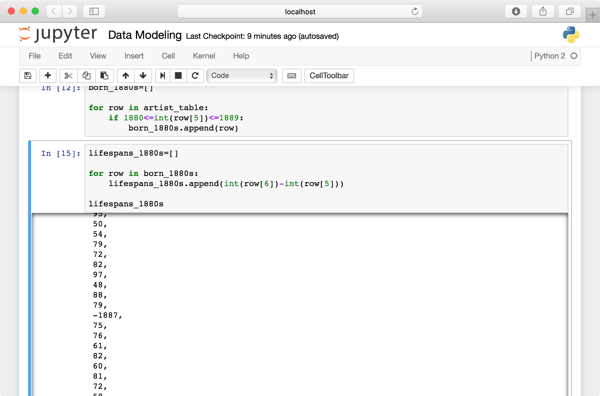

## Week 3 Outline: Data Modeling Outline

Sample datasets from The Museum of Modern Art (MoMA) [via GitHub](https://github.com/MuseumofModernArt/collection). Download these files to your /sharedfolder/ on your desktop.
- [Artists.csv](https://media.githubusercontent.com/media/MuseumofModernArt/collection/master/Artists.csv)
- [Artworks.csv](https://media.githubusercontent.com/media/MuseumofModernArt/collection/master/Artworks.csv)

#### Install LibreOffice

Before we start class, download and install LibreOffice:
- [https://www.libreoffice.org/](https://www.libreoffice.org/)


#### Run Docker container

In macOS, open Terminal and enter the following commands to launch the Docker container:

```
docker rm -f pcda_ubuntu
docker pull pcda17/ubuntu-container
docker run --name pcda_ubuntu -ti -p 8889:8889 --volume ~/Desktop/sharedfolder/:/sharedfolder/ pcda17/ubuntu-container
```

In Windows 10, open PowerShell and enter the following commands to launch the Docker container:

```
docker rm -f pcda_ubuntu
docker pull pcda17/ubuntu-container
docker run --name pcda_ubuntu -ti -p 8889:8889 --volume C:\Users\***username_here***\Desktop\sharedfolder:/sharedfolder/ pcda17/ubuntu-container
```


#### Open Jupyter Notebook (see notes in week 2)

#### CSV I/O in Python
Paste the following code snippet into a new Jupyter notebook.

```python3
import csv

artist_csv_path = "/sharedfolder/Artists.csv"
artist_table = []

with open(artist_csv_path) as fi:
    csv_input = csv.reader(fi)
    for row in csv_input:
        artist_table.append(row)

artist_header = artist_table[0]
artist_table.remove(artist_table[0])

artist_header
```


Check the length of the table, then enter an index value in brackets to look at an entry.

```python3
print(len(artist_table))

artist_table[6310]
```

We’ve just copied all the data from a CSV-formatted spreadsheet and turned it into a format Python can easily work with: a list of lists of strings. Let’s walk through the above a step at a time, this time loading MoMA’s artwork metadata.

We began by importing the `csv` module, Python’s built-in CSV input/output tool. Note, since you've already done it above, you don't have to do it again.

```python3
import csv
```
Next we assign our pathname to the `artwork_path` variable and initialize an empty list called `artwork_table`. This will become our list of lists, Python’s version of a table. Add the below to your open notebook.

```python3
artwork_csv_path = "/sharedfolder/Artworks.csv"
artwork_table = []
```

Then we create a file stream object `fi` that points to our spreadsheet, We pass our file object to `csv`’s constructor function and assign the new reader object to `csv_file`. Finally, using a for loop, we iterate through our csv object and add each row (represented by a list) to the master list `artwork_table`.

```python3
with open(artwork_csv_path) as fi:
    csv_file = csv.reader(fi)
    for row in csv_file:
        artwork_table.append(row)
```

Because this table uses column labels in the first row, we’ll save those labels to the variable `header` and remove it from the table.

```python3
artwork_header = artwork_table[0]
artwork_table.remove(artwork_table[0])
```

Finally, let’s look at our list of column titles …

```python3
artwork_header
```

… as well as a row in our table.

```python3
artwork_table[60946]
```

 **Tip:** Python will ignore any text following the “#” character on a line, which we can use to add explanatory comments within our code. Here are a couple lines from the snippet above followed by example notes.

>     artwork_header = artwork_table[0]  # saves list of column titles to variable 'artwork_header'
>     artwork_table.remove(artwork_table[0])  # removes header row


#### Quick Assignment
Write a piece of code that prints each column label in `artist_header` and `artwork_header` next to its index in the list, beginning from zero as usual. You may want to keep this reference handy for the next few exercises.

 _A possible solution:_

```python3
print('Artists\n')

for i in range(len(artist_header)):
    print(str(i) + ' ' + artist_header[i])

print('\nArtworks\n')

for i in range(len(artwork_header)):
    print(str(i) + ' ' + artwork_header[i])
```
#### Quick Assignment
Write a piece of code that creates a new table (i.e., list of lists) containing only artists born in the 1880s.

 _A possible solution:_

```python3
born_1880s = []

for row in artist_table:
    if 1880 <= int(row[5]) <= 1889:
        born_1880s.append(row)
```

#### Average Artist Age
Now that we’ve defined a meaningful subset of our data, let’s see what we can do with it. For instance, what was the mean life span of artists born in the 1880s (who happen to be included in MoMA's collections)?

```python3
lifespans_1880s = []

for row in born_1880s:
    lifespans_1880s.append(int(row[6]) - int(row[5]))

lifespans_1880s
```   


If you scroll through your list of lifespans, you’ll see occasional negative numbers (e.g., “-1887”). Since missing values are represented by “0,” if no death date is listed we’ll end up subtracting an artist’s birth year from zero. Let’s amend our code to leave out these rows.

```python3
lifespans_1880s = []

for row in born_1880s:
    age = int(row[6])-int(row[5])
    if age > 0:
        lifespans_1880s.append(age)

lifespans_1880s
```
Now that we have a list of valid integers, all we need to do is calculate the mean. Below we divide the sum of the list (which we cast as a float) by its length to get 72.65 years.

```python3
float(sum(lifespans_1880s)) / len(lifespans_1880s)
```

That format is a bit verbose for a simple task like this, so to make life easier we’ll use the Python package `NumPy`.

```python3
import numpy
numpy.mean(lifespans_1880s)
```
**Tip:** The code above imports the entire `numpy` package. Python also lets us import packages’ individual functions to the current environment, which can make code more compact.

```python3
from numpy import mean
mean(lifespans_1880s)
```
A common convention is to rename `numpy` to `np` at the import step.

```python3
import numpy as np
np.mean(lifespans_1880s)
```

This guide will use to `numpy.mean()` for the sake of clarity, but feel free to set up your environment however you like.

#### Quick Assignment
Write a piece of code that creates a new table containing all artworks that include the term “Fluxus” in any metadata field.

 _A possible solution:_

```python3
fluxus_table = []

for row in artwork_table:
    for cell in row:
        if 'fluxus' in cell.lower():
            if row not in fluxus_table:
                fluxus_table.append(row)
```

#### Fluxus Metadata Continued
Now let’s make a master list of entries under “medium” in our Fluxus metadata set.

```python3
medium_list = []

for row in fluxus_table:
    medium_list.append(row[9])

len(medium_list)
```

Let’s look at 10 random samples from the collection, first importing the `random` package.

```python3
import random

random.sample(medium_list, 10)
```


Let’s see what terms appear most frequently in our list of media.

```python3
from collections import Counter

c = Counter(medium_list)
c.most_common(10)
```


Note that 1151 artworks are missing an entry for “medium,” with the term “(CONFIRM)” appearing 190 times.

#### Quick Assignment
Returning to our original MoMA metadata table, write a piece of code that extracts only works created in the 1960s (or another decade of your choosing). Since the date field in MoMA’s metadata doesn’t follow a strictly defined numerical format, you’ll have to think about how to interpret values like “1963,” “1963-5“, “c. 1963,” “c. 1960s,” etc.
<!--Let students struggle with this a bit, then encourage them to settle on a relatively quick and dirty solution. The collection doesn’t have to be perfect; we’ll be cleaning the table in OpenRefine later.-->

 _A simple solution with high recall and low precision:_

```python3
art_1960s = []

for row in artwork_table:
    if '196' in row[8]:
        art_1960s.append(row)
```

<!--
 _A way-too-elaborate solution with better precision but imperfect recall:_

```python3
import string

def date_span(date_string):
         if len(date_string) == 0:return[-1,-1]
         temp_string = date_string
         if ', 1' in temp_string:
             temp_string = date_string.split(',')[1]
         elif ',' in temp_string:
             temp_string = date_string.split(',')[0]
         temp_string = temp_string.lower().replace('early ','').replace('late ','')
         if (len(temp_string)0)&(temp_string[0] != ['(']):
             temp_string = temp_string.split('(')[0]
         temp_string = temp_string.translate(None,"(){}<[]; ")
         try:
             if 'c.' in temp_string:
                 temp_string = temp_string.replace('c.','').strip()
             if temp_string.isdigit():
                 return [int(temp_string),int(temp_string)]
             if temp_string[-2:] == '0s':
                 return [int(temp_string.strip('s')),int(temp_string.strip('s'))+9]
             if '-' in temp_string:
                 pair = temp_string.split('-')
                 if len(pair[1].strip()) == 2:
                     return [int(pair[0].strip()),int(pair[0][:2]+pair[1].strip())]
                 elif len(pair[1]) == 4:
                     return [int(pair[0].strip()),int(pair[1].strip())]

                 else: print "error1: "+date_string + "- " + temp_string
         except: print "error2: "+date_string + " - " + temp_string

     art_temp = []
     for row in artwork_table:
         if '196' in row[8]:
             art_temp.append(row)

     art_1960s = []
     for row in art_temp:
         years = date_span(row[8])
         art_1960s.append(row)


    at_1960s[:15]
```

Note that the code above is an example of a decision tree, the absolute simplest kind of “artificial intelligence” algorithm.
-->

#### Sorting a Table by Column

We can sort a table based on the values in a given column with the `sorted` function and and the `itemgetter` tool, which we use to specify the column we’re sorting by. The following sorts the table `art_1960s` by artist name.

```python3
from operator import itemgetter
art_1960s_sorted = sorted(art_1960s, key = itemgetter(1))
```
Since each row is so long, let’s just look at our sorted set of authors. The following notation returns a list of  each row’s “Artist” cell, located at index 1.

```python3
[row[1] for row in art_1960s_sorted]
```


Let's look at the most common nationalities in our table of 1960s artworks. Here we’re once again using the `Counter` constructor from the `collections` package.

```python3
c = Counter([row[4] for row in art_1960s_sorted])
c.most_common(20)
```


It’s impossible to memorize the details of every specialized tool available in Python, so you’ll probably end up repeatedly looking up processes like these.

#### Writing CSVs
Now that we’ve filtered and sorted our metadata, let’s export it to a new CSV file called `art_1960s.csv`.

```python3
outpath = "/sharedfolder/art_1960s.csv"
o = open(outpath, 'w')
a = csv.writer(o)
a.writerow(artwork_header)
a.writerows(art_1960s_sorted)
o.close()
```
Note that we call use `writerow` function first to write the header row, then `writerows` to write the actual data.

Find the new file in `sharedfolder` and open it in Excel or LibreOffice. Take a few moments to explore the collection.


#### The Dictionary Data Type
So far, when we want to access the “Artist” field in MoMA’s metadata, we’ve been referring to its position in a given row.

```python3
row = art_1960s_sorted[7700]
row[1]
```
 _Output:_

 ```python3
'Helen Frankenthaler'
```

This system is straightforward and well-suited for many jobs, but for large, complex projects it can be difficult to keep track of all those index numbers. Instead, we can use a dictionary to reference metadata fields by name rather than list index.


Just like we can refer to a item in a list using brackets to enclose its position in the list, a dictionary, or dict, uses strings or numbers to identify each item in a collection. This data structure is known as a key-value pair. Here’s the simplest way to create a new dictionary.

```python3
artist_meta = {}
artist_meta['\ufeffConstituentID'] = 248
artist_meta['DisplayName'] = 'Richard Avedon'
artist_meta['ArtistBio'] = 'American, 1923–2004'
artist_meta['Nationality'] = 'American'
artist_meta['Gender'] = 'Male'
artist_meta['BeginDate'] = 1923
artist_meta['EndDate'] = 2004
artist_meta['Wiki QID'] = 'Q305497'
artist_meta['ULAN'] = '500013773'
```
The following is a more compact format for the same key-value assignment.

```python3
artist_meta = {'\ufeffConstituentID': 248, 'DisplayName': 'Richard Avedon', 'Gender': 'Male', 'BeginDate': 1923, 'EndDate': 2004, 'ULAN': '500013773', 'Wiki QID': 'Q305497', 'ArtistBio': 'American, 1923–2004', 'Nationality': 'American'}
```
To access a value, enter its key between brackets like so.

```python3
artist_meta['DisplayName']
```
And note that you can iterate over a dict to view and/or use its keys.

```python3
for key in artist_meta:
    print(key + " - " + str(artist_meta[key]))
```

Next, let’s create a dict for each artist MoMA’s artist metadata. Here’s a snippet (repeated from above) that loads `Artists.csv` as a list of lists called `artist_table`.

```python3
import csv

artist_csv_path = "/sharedfolder/Artists.csv"
artist_table = []

with open(artist_csv_path) as fi:
    csv_input = csv.reader(fi)
    for row in csv_input:
        artist_table.append(row)

artist_header = artist_table[0]
artist_table.remove(artist_table[0])

artist_header
```

Now we’ll use a for loop to iterate through `artist_table`, converting each list of cells to key-value format.

```python3
artist_dicts = []

for row in artist_table:
    artist_meta = {}
    artist_meta['\ufeffConstituentID'] = row[0]
    artist_meta['DisplayName'] = row[1]
    artist_meta['ArtistBio'] = row[2]
    artist_meta['Nationality'] = row[3]
    artist_meta['Gender'] = row[4]
    artist_meta['BeginDate'] = int(row[5])
    artist_meta['EndDate'] = int(row[6])
    artist_meta['Wiki QID'] = row[7]
    artist_meta['ULAN'] = row[8]
    artist_dicts.append(artist_meta)
```  

The list `artist_dicts` should now contain records for about 15,000 artists.

```python3
len(artist_dicts)
```
Specifying an index in brackets will return a dict object.

```python3
artist_dicts[12007]
```
And we can use one of our standard key names to get a particular value.

```python3
artist_dicts[12007]['DisplayName']
```


If we want to create a list of artist names, birth years, etc., we can thus iterate through the `artists_dicts` list and specify the field we want by name.
