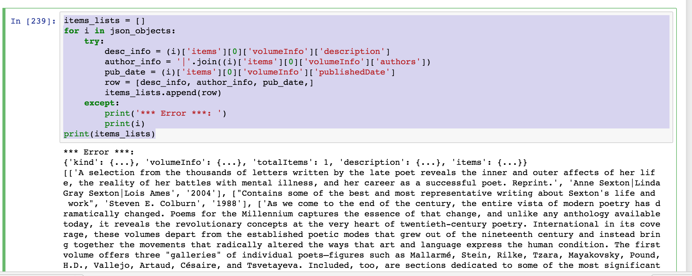

##Week 7: Data and Politics / CSVs and APIs

<!--
explain Rest APIs by showing how a google search can change by changing the URL
-->
Open Terminal in macOS and launch our Docker container:

```
docker rm -f pcda_ubuntu
docker pull pcda17/ubuntu-container
docker run --name pcda_ubuntu -ti -p 8889:8889 --volume ~/Desktop/sharedfolder/:/sharedfolder/ pcda17/ubuntu-container
```

In Windows 10, open PowerShell and enter the following to launch the Docker container:

```
docker rm -f pcda_ubuntu
docker pull pcda17/ubuntu-container
docker run --name pcda_ubuntu -ti -p 8889:8889 --volume C:\Users\***username_here***\Desktop\sharedfolder:/sharedfolder/ pcda17/ubuntu-container
```


Right click the following links and save the Jupyter notebook files to `sharedfolder` on your desktop. 

1. [CSV Input/Output in Python](https://raw.githubusercontent.com/pcda17/pcda17.github.io/master/week-07.1_CSV-Input-Output.ipynb)

2. [Using the Google Books API](https://raw.githubusercontent.com/pcda17/pcda17.github.io/master/week-07.2_Google_Books_API.ipynb)

3. [Scraping and Parsing XML finding aids](https://raw.githubusercontent.com/pcda17/pcda17.github.io/master/Week-06_Scraping-and-Parsing-XML.ipynb)

Navigate to [localhost:8889](localhost:8889) in your browser to open each notebook.

Helpful hint: you may get an error if you are running a loop for a field that is empty. The good news is that you can add a safety net for this kind of eventuality using the statements "try" and "except" as you see in this example: 

 
