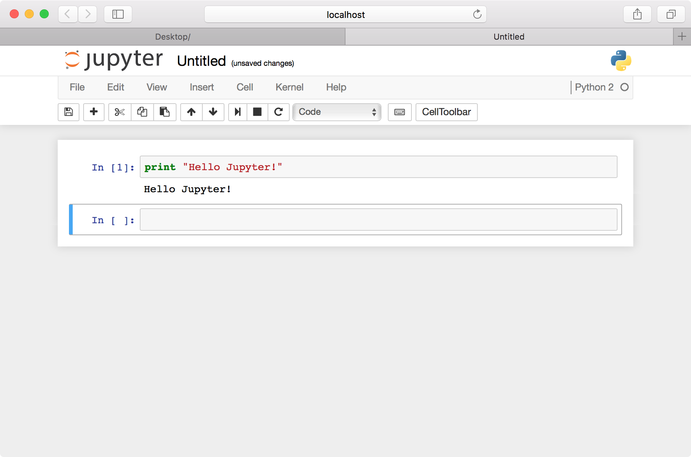
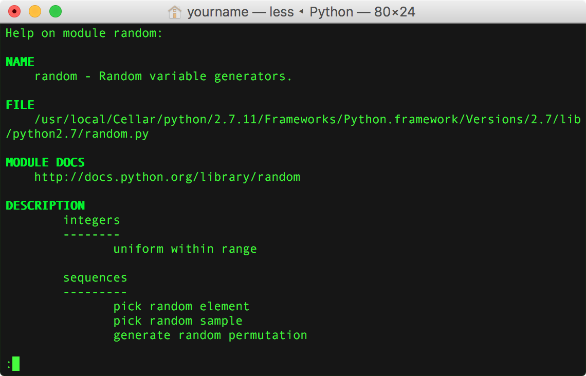

## Week 2 Outline: Python Intro and Text Manipulation

**Note:** For this class we’ll start by using Python’s read-eval-print loop (REPL) rather than Jupyter. Open Terminal and enter the following line to open the Python shell.

    python

#### Review of key points from reading
First we’ll address any questions about the reading and last week’s material. Then we’ll review a few points from Shieber’s coding tutorial, beginning with the `split`, `join`, and `replace` functions.

Assign a sentence to the variable `sentence` — in this case the opening line from John Kennedy Toole’s  _A Confederacy of Dunces_. Type the name of the variable and hit return to view your new string.

```    
sentence="A green hunting cap squeezed the top of a fleshy balloon of a head."
    
sentence
```

**Output:**

    A green hunting cap squeezed the top of a fleshy balloon of a head.

We’ll be using lists more often than any other data structure in the coming weeks, so it’s worth reviewing the details of Python’s slice notation. Let’s create a list of strings, then view a subset of the list to a new variable. Enter the variable “words2” to view the result.
    words=['A', 'green', 'hunting', 'cap', 'squeezed']
    words2=words[2:4]
    words2

The Python shell should print `['hunting', 'cap']`, i.e., the subset of the list “words” from index 2 to index 3. In general, `list_name[start:end]`, where “start” and “end” are integers, returns a subset of “list-name” from index `start` to `end-1`. The “end minus 1” bit may seem odd, but in practice it makes slice notation more readable. The snippet above, for instance, gives us a list containing 2 items, equal to 4-2. And if we want to excerpt the first three items in a list, the following notation will do the trick.

    words[:3]

Recall that omitting an index number before or after the colon means you want to include all items on that end of the list. The following returns everything from index 2 to the end of “words”: `['hunting', 'cap', 'squeezed']`.

    words[2:]

If you want to excerpt the last three entries in a list without counting from the beginning, use a negative number before the colon.

    words[-3:]

Likewise, the following will slice off the final 3 items in our list, returning `['A', 'green']`.

    words[:-3]

To reverse the order of a list, add an extra colon and “-1.”

    words[::-1]

It’s important to note that in Python, every string is a list of characters under the hood. We can thus reverse the spelling of a sentence like so.

    sentence="A green hunting cap squeezed the top of a fleshy balloon of a head."
    sentence[::-1]

If want to break our sentence into words, we can use the `split()` function to create a list of substrings with the space character as delimiter.

    words=sentence.split(' ')
    words

The `join()` function reverses the process, inserting a chosen string (here, a space) between each item in a list. Note that “sentence2” below is identical to our original “sentence” string.

    sentence2=' '.join(words)
    sentence2
    sentence

#### Quick Exercise
Using the functions described above, create a single string containing the words our sentence in reverse order. 

> _A possible solution:_
>
>     ' '.join(sentence.split(' ')[::-1])

#### Review Continued
Another useful string function is `replace()`, which lets us swap out one substring for another.

    sentence3=sentence.replace('hunting','baseball')
    sentence3

Finally, note that a number can be represented as one of three data types: integer, float, or string.

    sample_int=35
    sample_float=35.4
    sample_string='35'
    sample_int
    sample_float
    sample_string

We can convert among these formats using the `int()`, `float()`, and `str()` functions. After assigning the values below, enter each variable’s name and be sure you understand the result.

    cast_int=int(35.4)
    cast_float=float(35)
    cast_string=str(35)
    cast_int
    cast_float
    cast_string

A string that includes only numbers and possibly a decimal point — no commas or other characters — can also be cast to the int or float data type.

    x=int('75')
    y=float('107.5')
    x
    y


#### Text I/O in Python
Now we’ll review reading and writing text files from the Python environment. Download the following file from Project Gutenberg or the mirror provided and save it to your desktop. It’s a collection of essays by Jonathan Swift, including a line that Toole references in the title _A Confederacy of Dunces_.
- [http://www.gutenberg.org/cache/epub/623/pg623.txt](http://www.gutenberg.org/cache/epub/623/pg623.txt)
- [mirror](http://www.stephenmclaughlin.net/pcda/sample_data/week-2/pg623.txt)

First we’ll assign the file’s pathname to the variable `filepath` and create the file stream object we’ll use to read its contents. Open the Python shell and enter the following lines.

    filepath="/Users/yourname/Desktop/pg623.txt"
    file=open(filepath)
    
> _Output:_
>
>     'You must apply to Mrs. Brent, {2}\r\n'

Then we’ll make an empty list called `swift_lines` and iterate through our file stream using a for loop, adding each line to the list as we go.

    swift_lines=[]
    for line in file:
         swift_lines.append(line)

Finally, we’ll close our file stream and view a line from our list.

    file.close()
    swift_lines[1000]

> **Tip:** In OS X you can drag a file from Finder to a Terminal window instead of entering the pathname by hand. If the path contains any spaces, these will be escaped (preceded by a backslash) in keeping with the conventions of Unix-like interfaces.
> Python’s `os` module, however, doesn’t recognize escaped characters. In order to avoid confusion, it’s probably best to avoid using spaces in filenames.

Each line ends with `\r\n` , a carriage return followed by a line feed character, suggesting the file was created in a Windows text editor. As Oualline and Noria discuss in this week’s readings, Unix-like systems generally use `\n` to indicate newlines, while `\r\n` is standard in Windows and DOS. To complicate matters, early Apple computers used `\r` on its own for the same purpose. 

> **Tip:** While the term “newline” refers to any character or character combination used to mark the end of a line, when we say “newline character” for the rest of the course we’ll mean `\n` (formally called “line feed”) unless otherwise noted.


You may have noticed that our text file from Project Gutenberg is broken into short lines, none longer than 74 characters. Many ASCII text files follow this fixed-width convention, designed to fit the 80-character width of many early PC displays. That display format, in turn, was chosen to work with data from 80-column punch cards, introduced by IBM in the 1920s.

Whether we’re adapting to quirks of history or fixing typing mistakes, we’ll often find it helpful to get rid of whitespace characters (newlines, spaces, tabs) at the beginning and end of a given string. For a string named `line`, `line.strip()` will return a copy of the string with all newlines and other whitespace characters removed from either end.

    line=lines[1000]
    line
    line.strip()

#### Python Text I/O Continued

Closing a file stream with `close()` when you’re done with it is good style, though it’s not strictly required. If you want to keep your code compliant yet crisp, the following format closes a file stream automatically.

    lines=[]
    with open(filepath) as file:
         for line in file:
               lines.append(line) 

Or you can use this command, which does the same in one line.

    lines=open(filepath).readlines()

Note that calling `readlines()` creates a list of all lines in a text file, including any newline characters (in this case, `\r\n` ). We could easily use a for loop with the `strip()` function to remove newlines from each string in the list, but the following line does the same in a shorter form. Here `open()` creates a file stream and `read()` returns the file’s contents as a single string. Finally, `some_text.splitlines()` returns a list of lines in the string `some_text`, removing newline characters along the way.

    lines=open(filepath).read().splitlines()

If we’d like to convert our list of lines to a block of flowable text, we can use `join()` to combine all items in the list `lines`, each separated by a space. Note that we end up losing the paragraph breaks that we saw in the original file.

    ' '.join(lines)

#### Accessing Text Files on the Web

The Python module `urllib2`  makes grabbing text from the Web as easy as working with local files. Let’s download the first two chapters of _A Confederacy of Dunces_ in plain ASCII format.

    import urllib2
    url="http://www.stephenmclaughlin.net/pcda/sample_data/week-2/Toole_A-Confederacy-of-Dunces_Ch1-2.txt"
    toole_lines=urllib2.urlopen(url).read().splitlines()

Let’s look at the 200th line in the file.

    toole_lines[199]

> _Output:_
>
>     'Ignatius had himself broken the baseball machine by kicking it.'

Since we’ll be doing a lot of text filtering this semester, you should get used to checking whether a string includes a specified substring.

    if "Reilly" in "Ignatius J. Reilly":
         print "yes"

To do a case-insensitive substring search, use the `lower()` function to convert your original string to lowercase. If your search term contains any capital letters, you’ll want to convert it to lowercase as well.

    if "reilly" in "Ignatius J. Reilly".lower():
         print "yes"

Try creating a simple text filter or two, printing all lines that contain a given substring.

    for line in toole_lines:
         if "orleans" in line.lower():
              print line
    
    for line in toole_lines:
         if "doughnut" in line.lower():
              print line

While you’re at it, use a for loop to identify the sentence by Jonathan Swift (in `swift_lines`) that Toole references in his title _A Confederacy of Dunces_. Try to resist the urge to use ⌘+F in TextWrangler.

#### Defining Functions

We talked a bit about functions last week, but let’s review. Note that when you define a function in the Python shell, pressing return once will move you to the next line within the function-in-progress. Hit return again to finish the function definition and return to the standard Python shell.

Here is a simple function that multiplies a number (float or int) by itself.

```python
def square(number):
     return number*number

square(11)
```

Note that functions can be nested within one another. The following will call the `square` function twice.
    square(square(11))

We can also create functions that take two or more arguments.

```python
def multiply(x,y):
    return x*y
    
multiply(4,6)
```

And here’s an example of a function that manipulates string data.

```python
def pluralize(string):
     return string+'s'

pluralize("eagle")
```

> **Tip:** There’s a difference between ending a function with `return` as opposed to `print`. Using “return” allows you to assign function output to a variable or pass it to another function, while “print” simply displays text in the Python shell.

Python is weakly typed, meaning intended data types don’t need to be specified in advance when we create a function. Applying an operation to a value of the wrong type will produce an error.

    square("eagle")
    pluralize(1960)

Using the `str`, `int`, and `float` functions, we can cast values as string, int, or float data types (when doing so is possible).

```python
def pluralize(string):
     print str(string)+'s'

pluralize(1960)
```

#### Generating pseudorandom numbers
It is often useful to generate random numbers or make random selections from a set of data. Note that Python can’t generate a mathematically pure sequence of random values; instead, it creates what are called “pseudorandom” values. Details of the difference are beyond the scope of this course, but when we use the term “random” below we really mean “pseudorandom.”

Import the `random` module and generate a random float X, where 0 \<= X \< 1.

    import random
    random.random() 

Return a random integer from 0 to 49.

    int(random.random()*50)

This is equivalent to the following:

    random.randint(0,49)

Note that `randint` is inclusive, so it may output 49, the second argument we passed it.

#### Quick Assignments
Assign a list of strings to a variable — in this case, a collection of foods mentioned in Toole’s novel. 

    foods=['macaroon', 'hot dog', 'jelly doughnut', 'Dr. Nut', 'wine cake', 'Dutch cookies', 'stuffed eggplant', 'jumbalaya with shrimps', 'brownie']

_Assignment:_ Write a function that accepts a list of strings and returns a randomly chosen value.

> _A possible solution:_
>
>     def random_choice(list):
>          return list[int(random.random()*len(list))]
>     
>     random_choice(foods)

_Assignment:_ Create a new function that returns a list of 3 randomly chosen strings. Don’t worry about repetitions.

> _A possible solution:_
>
>     def random_three(list):
>          temp_list=[]
>          for i in range(3):
>                temp_list.append(random_choice(list))
>          return temp_list
>     
>     random_three(foods)

_Assignment:_ Modify the function to return a list of 3 random strings containing the letter “a.” Don’t worry about repetitions.
    def random_three_with_a(list):
         temp_list=[]
         while(len(temp_list)<3):
               temp_choice=random_choice(list)
               if 'a' in temp_choice:
                     temp_list.append(temp_choice)
         return temp_list
    
    random_three_with_a(foods)

As you might expect, Python provides tools to speed up the work you just did by hand. The following returns a single randomly selected item from a list.
    random.choice(foods)

This line returns a list of three random selections without repetition.

    random.sample(foods,3)

And this one shuffles the order of a list’s contents, overwriting the original list.

    random.shuffle(foods)

#### Random Word

Now let’s choose a random word from the English lexicon. Most Unix-like systems include a standard word list called `words`, which some programs use  (or used to use) for spell checking. Let’s assign the pathname for `words` to the variable `word_path`, then load the file as a list of individual words.

    word_path = "/usr/share/dict/words"
    words = open(word_path).read().splitlines()

Let’s check the length of our lexicon. It should be well over 200,000 words.

    len(words)

Enter the following to generate a list of 50 random words.

    random.sample(words,50)

Is there anything notable about the words in this random list? If so, how might you explain the pattern?

#### Text Processing Oddities

By this point you’ve likely noticed that text strings can be enclosed in single quotes (`'Miss Trixie'`) or double (`"Patrolman Mancuso"`) at the coder’s discretion. 

If we use double quotes, our string can contain single quote characters without ambiguity. Note that the first line below returns an “invalid syntax” error, while the second is successful.

    some_text='How I'm supposed to know who's a cop? Everybody looks the same to me.'
    some_text="How I'm supposed to know who's a cop? Everybody looks the same to me."

Likewise, single quotes can be used to assign a string containing double quotes.

    some_more='"We goin back to the factory," the spokesman for the choir, the intense lady, said angrily to Ignatius. "You a bad man. I believe a po-lice looking for you."'

To include newline characters and/or any combination of single and double quotes, Python lets us bound strings with triple quotes (i.e., three single quotes in a row). Copy the entire code block below and paste it into the Python shell.

    even_more_text='''"My," Ignatius said to the old man after having taken his first bite. "These are rather strong. What are the ingredients in these?"

    "Rubber, cereal, tripe. Who knows? I wouldn't touch one of them myself."

    “They're curiously appealing,” Ignatius said, clearing his throat. "I thought that the vibrissae about my nostrils detected something unique while I was outside."

    Ignatius chewed with a blissful savagery, studying the scar on the man's nose and listening to his whistling.'''

By default, Python string objects represent text via 8-bit ASCII, a version of a bare-bones text encoding format dating back to the 1960s. Python also supports 16-bit Unicode (UTF-16), a more recent standard that includes ~120,000 characters from a vast array of contemporary and historical scripts, as well as symbol sets including abstract shapes and every emoji. In Python, Unicode strings are immediately preceded by the letter `u`.

    ascii_text="This is an ASCII string."
    unicode_text=u"This is a Unicode string."
    ascii_text
    unicode_text

Note that we can cast Unicode text to ASCII with the `str()` function.

    str(unicode_text)


#### Quick Exercises

_Exercise:_ Download a text file from Project Gutenberg and print 14 randomly chosen lines.

> _A possible solution:_
>
>     url="http://www.gutenberg.org/cache/epub/623/pg623.txt"
>     swift_lines=urllib2.urlopen(url).read().splitlines()
>     
>     random_lines=random.sample(lines,14)
>
>     for line in random_lines:
>          print line

> **Tip:** If you have trouble downloading a file from Project Gutenberg, open the [URL](http://www.gutenberg.org/cache/epub/623/pg623.txt) in your browser and complete a CAPTCHA to prove you’re human. 

_Exercise:_ Modify your code to return 14 random lines containing a chosen word or phrase.

> _A possible solution:_
> 
>     url="http://www.gutenberg.org/cache/epub/623/pg623.txt"
>     swift_lines=urllib2.urlopen(url).read().splitlines()
>     
>     swift_she=[]
>     
>     for line in swift_lines:
>          if "she" in line.lower():
>                swift_she.append(line)
>     
>     for line in random.sample(swift_she,14):
>         print line

_Exercise:_ Try using a different text and compare the results.

> _A possible solution:_
>
>     url="http://www.gutenberg.org/cache/epub/14328/pg14328.txt"
>     boethius_lines=urllib2.urlopen(url).read().splitlines()
>     
>     boethius_she=[]
>     
>     for line in boethius_lines:
>          if "she" in line.lower():
>                boethius_she.append(line)
>     
>     for line in random.sample(boethius_she,14):
>         print line


#### Installing and Launching Jupyter 
Beginning next week, we’ll be using “notebook” files in Jupyter to write, run, and store code for class exercises. You should have installed it last week; if not, do so now using `pip`.

    pip install -U jupyter

To launch Jupyter, open a terminal window and enter the following line. Jupyter’s interface will appear in a new window in your Web browser.

    jupyter notebook


In the Jupyter window, navigate to Desktop or wherever you’d like to create your first Jupyter notebook. Click the “New” in the upper right, then choose “Python 2” from the drop-down menu.


You’re now in the Jupyter environment. Here, you can create a series of “cells” for individual chunks of code, which can be saved and run repeatedly. Click the ✚ icon on the top left to add a new cell.

Type a line of code that prints a string. To run the current cell, either click the `►❙` icon or go to the “Cell” menu and choose “Run Cells.”

    print "Hello Jupyter!"




Note that each cell’s output is displayed right below to the the code that produced it, which is a major benefit of working in Jupyter. We’ll learn more about the Jupyter environment next week. For now, switch back to Terminal.

#### View list of all installed Python modules

Enter the following command to enter Python’s help shell.

    help()

Now enter the following and press return. After a moment, Python will display a list of all available modules.

    modules

Enter the name of a module and press return to view its help page, including a list of the module’s functions and other resources.

    random



Press `q` to close the help page, then hit return to get back to the Python shell. You can jump straight to module’s help page by passing its name to the `help()` function.

    help('random')

Or if the module is already imported, you can refer to the module itself.

    import random
    help(random)

To view a pared-down list of module resources, use the `dir()` function instead.

    dir(random)


The result is a challenge to read through, so let’s introduce the `pprint`, or “pretty-print” module.

    import pprint
    pp = pprint.PrettyPrinter()
    pp.pprint(dir(random))


`pprint` displays one item from the list per line, a much more readable format. We won’t mention `pprint` often in these tutorials, but keep it in mind for your own future use.


#### The `os` module
The `os` library contains many useful tools for working with local files and even issuing commands directly to the system shell. We’ll start by importing the `os` module, navigating to the desktop, and creating a list of the directory’s contents.

    import os
    os.chdir("/Users/yourname/Desktop/")
    file_list=os.listdir("./")
    file_list

> **Tip:** The `os` library won’t recognize the `~/` shortcut for a user’s local files.

The `os.system` function lets us issue commands at the level of the system shell. The following example will print the contents of your desktop. Note that whereas `os.listdir()` returns a list object containing filenames, the following simply displays a list of files as if you were using the Bash shell.

    os.system("ls /Users/yourname/Desktop/")

> **Tip:** Spaces in filenames are handled differently in `os.chdir` and `os.system`. In the latter case they must be escaped (preceded by a backslash) in keeping with Unix conventions, while in the former escaped spaces will generate errors. For convenience, it’s helpful to avoid spaces in filenames.


#### Downloading Reviews from Amazon (the hard way)

Open Jupyter and start a new notebook. 

    jupyter notebook.

Enter the following in a cell.

```python
import urllib2
url="http://www.amazon.com/Confederacy-Dunces-John-Kennedy-Toole/dp/0802130208"
page=urllib2.urlopen(url).read()

print page
```

To make things simple, let’s skip the reviews at the top of the page and only process the ten that appear below. Find a piece of text that only appears between the two sections — “Filter by:” is a good example — and use `split()` to make a list with two elements. Then assign the second chunk (at index 1) to the `page` variable.

    page=page.split("Filter by:")[1]

Next we’ll split the remaining text into individual reviews. Note that the “review rating” HTML class is used at the beginning of each review. We’ll split our page 
at those points, using triple quotes to include the end of the HTML tag.

    segs=page.split('''review-rating">''')
    print segs[0]

Since the first item in our list of segments comes before the first review, we’ll remove it using list index notation.

    segs=segs[1:]

Now the first element of our list should begin with a review.

    print segs[0]

Now let’s remove the code following each review. Since the text “Was this review helpful to you?” appears after every review, let’s use that as our delimiter. We’ll split each segment at that point and discard everything that follows it using list bracket notation.

```python
segs2=[]
for segment in segs:
     segs2.append(segment.split("Was this review helpful to you?")[0])

test_seg=segs2[0]
print test_seg
```

Now that our reviews are roughly cut down to size, let’s clean them up by removing HTML tags. The following function uses Python’s `re` module for working with regular expressions to replace any text between `<` and `>` with a newline. We’ll talk more about regular expressions later in the course.

    import re
    def strip_html(data):
         p = re.compile(r'<.*?>')
         return p.sub('\n', data)


Let’s see an HTML-free version of the segment we looked at above.

    strip_html(test_seg)

Note that there are multiple newlines between fields of interest, each one corresponding to a tag that’s been removed. Since we’d like to create a list of fields, we could use `split('\n')` to divide the text at each newline character — but then we’d also break up reviews with multiple paragraphs. Instead we’ll use pairs of newlines as our delimiter.

    temp_list=strip_html(test_seg).split('\n\n')
    print temp_list

We’re getting there, but our list contains some empty strings and several entries may begin with newline characters. We can take care of these issues with a for loop, creating a new list that excludes empty strings and applies `strip()` to remove whitespace from each field we add.

```python
review_list=[]
for item in temp_list:
     if item!='':
           review_list.append(item.strip())

print review_list
```


#### In-Class Exercise

Open TextWrangler or your text editor of choice. Drawing on the code examples above, create a script that accepts a URL and produces a list of lists, one for each review on the page. A good strategy is to split the work between two functions: one that accepts a segment of the text and code (such as `test_seg` above) and returns a cleaned-up list of fields, and a second that 

You can use the `html_stripper` function above or modify it at will.


> _A possible solution:_
>
>     import urllib2
>     import pprint
>     pp = pprint.PrettyPrinter()
>     
>     import re
>     def striphtml(d_ata):
>          p = re.compile(r'<.*?>')
>          return p.sub('\n', data)
>     
>     def review_to_list(segment):
>          temp_list=striphtml(s_egment).split('\n\n')
>          review_list=[]
>          for item in temp_list:
>                if item!='':
>                review_list.append(item.strip())
>          return review_list
>     
>     def page_to_table(url):
>          page=rllib2.urlopen(url).read()
>          page=page.split("Filter by:")[1]
>          segs=page.split('''review-rating">''')
>          segs=segs[1:]
>          segs2=[]
>          for segment in segs:
>                segs2.append(segment.split("Was this review helpful to you?")[0])
>          table=[]
>          for segment in segs2:
>                table.append(review_to_list(segment))
>          return table
>     
>     url="http://www.amazon.com/Confederacy-Dunces-John-Kennedy-Toole/product-reviews/0802130208/ref=cm_cr_dp_see_all_btm?ie=UTF8&showViewpoints=1&sortBy=recent"
>     review_table=page_to_table(url)
>     
>     pp.pprint(review_table)


    outpath="/Users/yourname/Desktop/amazon.csv"
    o = open(outpath, 'w')
    a = csv.writer(o)
    a.writerows(review_table)
    o.close()


## Demonstrate server-side Python script
- Create a text file containing Python code to print “Hello world!”
- Add shebang line at top of file:
```
  #!/usr/bin/env python
```
- Name the file `page.html.py`
- Upload file to server and set file permissions to 755.
- Open URL in browser.


#### Optional Exercise: Podcast this Directory
Working in pairs, create a server-side script that detects mp3 files in a given directory and creates an podcast RSS feed from the list.
- Example podcast feed: [https://www.dropbox.com/s/x5ubi18086eod9n/simple\_podcast.rss?dl=0](#)
- Example solution: [Link](#)

### 2:35 Discuss next week’s assignments and reading


