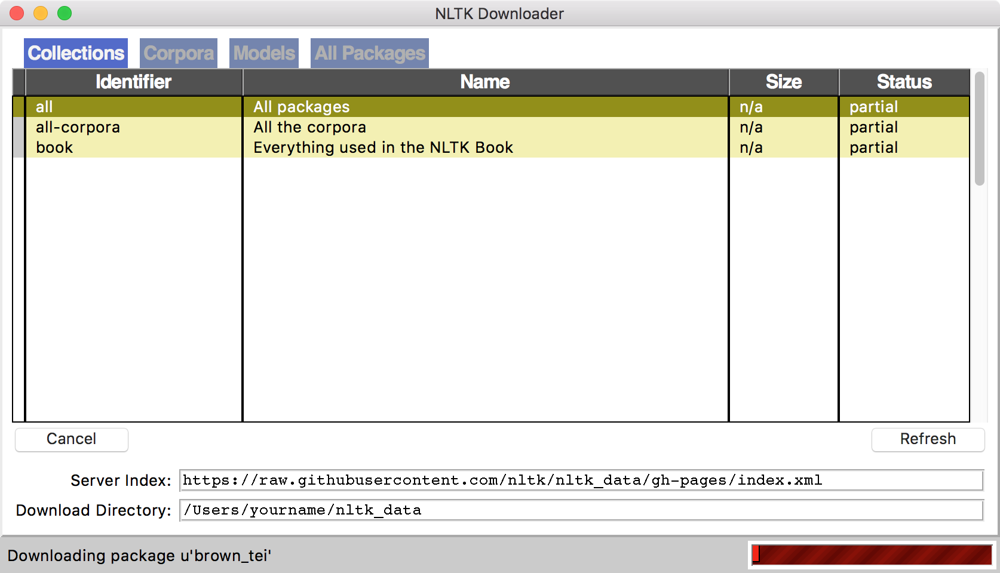

## Week 4: Word-Level Text Analysis


### Class Objective
Use text analysis techniques introduced by Montfort to examine and compare small text corpora.

#### Loading Corpora
Today we will be analyzing and comparing two small text corpora. Choose two text sets from the following list:

- [Works of Ralph Waldo Emerson](http://www.stephenmclaughlin.net/pcda/sample-data/week-4/Emerson.zip)
- [Works of Oscar Wilde](http://www.stephenmclaughlin.net/pcda/sample-data/week-4/Wilde.zip)

Enter the following in the shell to open Jupyter. Create a new notebook Python 2 notebook.

	jupyter notebook

First, load each author’s works as a list of strings.

```python
	import os

	corpus1="/Users/yourname/Desktop/Sample-Data/Week-4/Emerson/"
	corpus2="/Users/yourname/Desktop/Sample-Data/Week-4/Wilde/"
	
	os.chdir(corpus1)
	corpus1_filenames=os.listdir("./")
	
	corpus1_texts=[]
	
	for filename in corpus1_filenames:
	    text=open(filename).read().replace("\n"," ") #replaces newlines with spaces
	    corpus1_texts.append(text)
	
	os.chdir(corpus2)
	corpus2_filenames=os.listdir("./")
	
	corpus2_texts=[]
	
	for filename in corpus2_filenames:
	    text=open(filename).read().replace("\n"," ") #replaces newline characters with spaces
	    corpus2_texts.append(text)
```

#### TextBlob Review

Let’s review the TextBlob package, introduced in this week’s reading by Nick Montfort. First, let’s load TextBlob and convert two texts to lists of words. Note that each is contained in a WordList object, which we can manipulate as if it were an ordinary list.

```python
	from textblob import TextBlob
	
	text1=TextBlob(corpus1_texts[0])
	print text1.words[:15]
	
	text2=TextBlob(corpus2_texts[0])
	print text2.words[:15]
```

We can also print sentences, contained in Sentence objects.

	print text1.sentences[:5]
	print text2.sentences[:5]

Note the following methods of manipulating your TextBlob results.

	print sorted(text1.words) #prints sorted list of all words
	print sorted(list(set(text1.words))) #prints sorted list of unique words


#### Quick Exercise

Each TextBlob object contains a dictionary with the number of times each word appears in a text. 

	print text1.word_counts

Create a function that returns the top 20 most frequent words in a given TextBlob object. Hint: Use the itemgetter module to sort a list of lists by a given index.

Possible answer:

```python
	from operator import itemgetter

	freq_dict=text1.word_counts
	freq_list=[]
	
	for key in freq_dict:
	    freq_list.append([key,freq_dict[key]])
	
	sorted_freq_list=sorted(freq_list, key=itemgetter(1))[::-1]
	
	print sorted_freq_list[:20]
```

What do you notice about these words?

#### Word Frequency Sans Stopwords
Let’s load the `nltk` module, which was installed as a dependency of TextBlob. Then we’ll download its additional packages and corpora.

	import nltk
	nltk.download()

A Python GUI window should appear on your screen. Select “All packages” and click “Download.” The download and installation should take a minute or two.


In computational text analysis, the term “stopword” refers to words that appear frequently in most texts in a given language — e.g., “I,” “the,” “and,” “while,” and so on. NLTK provides a useful stopword list.
	from nltk.corpus import stopwords
	stopwords.words('english')


Now let’s look at the most frequent words in a text, disregarding stopwords.

```python
	from textblob import Word

	stopwords_eng=stopwords.words('english')
	freq_dict=text1.word_counts
	
	freq_sans_stopwords=[]
	
	for key in freq_dict:
	     lemma=Word(key).lemmatize()
	     if lemma not in stopwords_eng:
	           freq_sans_stopwords.append([key,freq_dict[key]])
	
	sorted_freq_sans_stopwords=sorted(freq_sans_stopwords, key=itemgetter(1))[::-1]
	
	print sorted_freq_sans_stopwords[:20]
```

How do you interpret this list? Does it give you any insight into the text you’re looking at?


## Quick Exercise
Referencing the code above, create a function that returns a sorted list of stopword-free word frequency lists when passed a TextBlob object. Look at the top vocabulary for several texts by each of your authors. How similar or different are these frequency lists between texts and between authors?

_A possible solution:_
	def topwords(blob):
	    stopwords_eng=stopwords.words('english')
	    freq_dict=blob.word_counts
	    freq_sans_stopwords=[]
	    for key in freq_dict:
	        lemma=Word(key).lemmatize()
	        if lemma not in stopwords_eng:
	            freq_sans_stopwords.append([key,freq_dict[key]])
	    sorted_freq_sans_stopwords=sorted(freq_sans_stopwords, key=itemgetter(1))[::-1]
	    return sorted_freq_sans_stopwords
	
	print topwords(text1)[:20]
	print topwords(text2)[:20]

#### POS Tagging
We can also use TextBlob to create a list of part-of-speech tags for each word in a text.
	print text1.tags

Let’s take a close look at our results. Examine two or three sentences a word at a time and check whether parts of speech were tagged correctly. If you find any mistakes, can you guess why the tagging algorithm slipped up?

Following Montfort’s example, let’s create a function that counts the number of adjectives in a text.

	def adjs(text):
	    count = 0
	    for (word, tag) in text.tags:
	        if tag == 'JJ':
	            count+=1
	    return count
	
	print adjs(text1)

And another function to calculate the percentage of words in the text that are tagged as adjectives.

	def adj_percent(text):
	    return float(adjs(text))/len(text.words)
	
	print adj_percent(text1)

#### Exercise
Create a function called `POS_profile` that takes a TextBlob object and returns a list containing several parts of speech and their relative frequency within the text. Your POS profile should include the following parts of speech:

- nouns
- adjectives
- verbs
- adverbs
- pronouns

You can find a full list of POS tags used by TextBlob [here](https://www.ling.upenn.edu/courses/Fall_2003/ling001/penn_treebank_pos.html). Note that several parts of speech are split into multiple codes (e.g., NN, NNS, NNP, and NNPS for different classes of noun).

Next, run your POS profile on each text in your two corpora. How much do these values vary between authors and among texts by the same author?

_A possible solution:_
	def POS_profile(blob):
	    noun_codes=['NN','NNS','NNP','NNPS']
	    adj_codes=['JJ','JJR','JJS']
	    verb_codes=['VB','VBD','VBG','VBN','VBP','VBZ']
	    adv_codes=['RB','RBR','RBS']
	    pronoun_codes=['PRP']
	    noun_count=0
	    adj_count=0
	    verb_count=0
	    adv_count=0
	    pronoun_count=0
	    for (word, tag) in blob.tags:
	        if tag in noun_codes: noun_count+=1
	        if tag in adj_codes: adj_count+=1
	        if tag in verb_codes: verb_count+=1
	        if tag in adv_codes: adv_count+=1
	        if tag in pronoun_codes: pronoun_count+=1
	    word_count=len(blob.words)
	    return [float(noun_count)/word_count, float(adj_count)/word_count, float(verb_count)/word_count, float(adv_count)/word_count, float(pronoun_count)/word_count]

#### Break

#### Naive Bayes Classification

Review classification examples from Montfort text.

#### Exercise

Divide each of your corpora into two sets, one for training our classifier and one for testing. Split each text into a list of sentences and combine these to create four master lists: author 1 training, author 1 testing, author 2 training, author 2 testing.

Create a Naive Bayes classifier using your two training sets. Run the classifier on each sentence in your test sets and calculate the accuracy of your model.

Examine sentences that were misclassified. Why do you think the algorithm was misled?

#### Sentiment Analysis

If time permits.

#### Using WordNet

If time permits.
