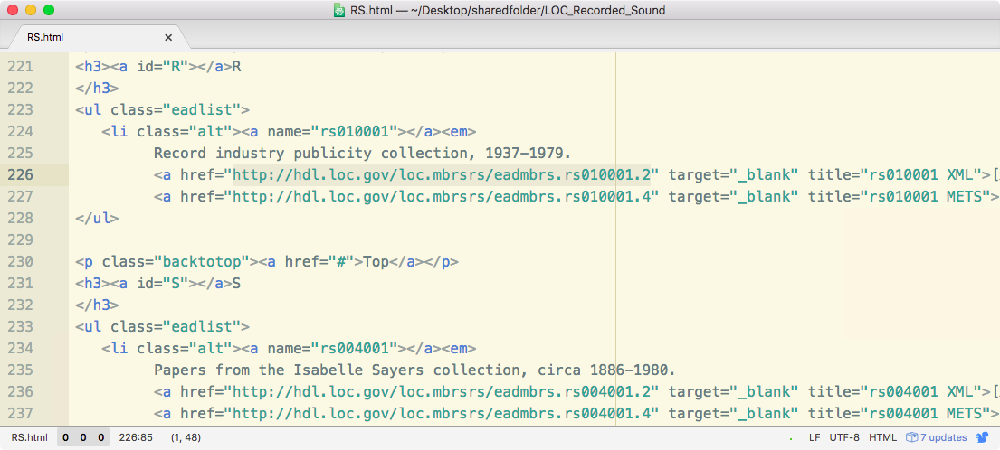
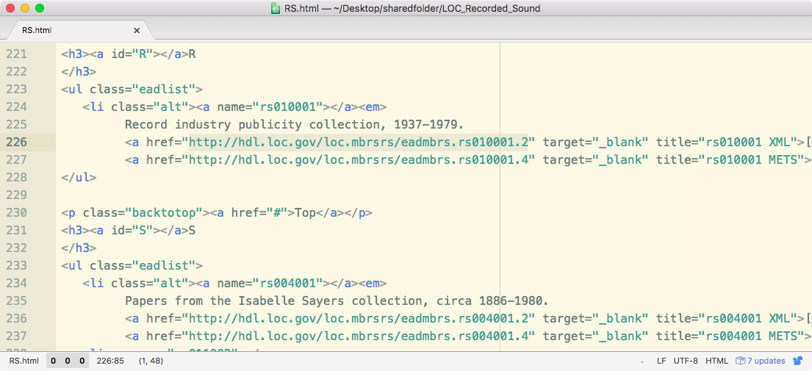

## Week 6

#### Mini-Lecture on Public Key Encryption
Gloss [Fermat’s Little Theorem](http://mathworld.wolfram.com/FermatsLittleTheorem.html) and [public key cryptography](http://www.pgpi.org/doc/pgpintro/).
- [https://www.ocf.berkeley.edu/~mattkc/blog/?p=106](https://www.ocf.berkeley.edu/~mattkc/blog/?p=106)
- [http://stackoverflow.com/questions/29595849/explain-a-code-to-check-primality-based-on-fermats-little-theorem](http://stackoverflow.com/questions/29595849/explain-a-code-to-check-primality-based-on-fermats-little-theorem)

Describe the [PGP](https://en.wikipedia.org/wiki/Pretty_Good_Privacy) standard its free software implementation as [GnuPG](https://www.gnupg.org/). Touch on 1990s [Crypto Wars](https://en.wikipedia.org/wiki/Crypto_Wars).

#### Encrypted Zip File
> zip -e [archive](#) [file](#)
For encrypting multiple files with a password, such as folder or an entire directory, the syntax would be as follows:
zip -er [archive](#) [folder](#)

#### Using GPG to encrypt and decrypt messages
Strong encryption is useful when moving sensitive data from one place to another, such as confidential data from research participants. Install GPG via the [GPGTools](https://gpgtools.org/) bundle or enter the following in the shell:
	brew install gpg

> GPG tutorial adapted from [http://edoceo.com/cli/gpg](http://edoceo.com/cli/gpg)
Before you can encrypt or sign files with GPG you must have a key.
	gpg --gen-key

Post the public, ascii side of your key to the web
	gpg --armor --output pubkey.txt --export 'Your Name'
	gpg --send-keys 'Your Name' --keyserver hkp://subkeys.pgp.net

Here we encrypt/decrypt a file that is just for our own use.
	gpg --encrypt --recipient 'Your Name' foo.txt
	gpg --output foo.txt --decrypt foo.txt.gpg

Encrypting for Recipient
	gpg --search-keys 'myfriend@his.isp.com' --keyserver hkp://subkeys.pgp.net
	gpg --import key.asc
	gpg --list-keys
	gpg --encrypt --recipient 'myfriend@his.isp.net' foo.txt

Decrypting
	gpg --output foo.txt --decrypt foo.txt.gpg

Signagures
	gpg --verify crucial.tar.gz.asc crucial.tar.gz
	gpg --armor --detach-sign your-file.zip

#### Politically Charged Datasets
Discuss [Cryptome](http://cryptome.org/), [WikiLeaks](https://wikileaks.org/), and [The Panama Papers](https://panamapapers.icij.org/).

Discuss [Tor](https://www.torproject.org/) and the dark web.
- [I2P](https://geti2p.net/en/), [Freenet](https://freenetproject.org/), etc.

Discuss Aaron Swartz

#### Break

#### Extracting and Cleaning PDF Text

#### Working with PDF Metadata
Reading pdf metadata via python from command line
	exiftool file.pdf

#### Install PyExifTool
- [https://smarnach.github.io/pyexiftool/](https://smarnach.github.io/pyexiftool/)

	python setup.py install --user

	import exiftool
	import pprint
	pp = pprint.PrettyPrinter()
	
	pdf_path="/Users/yourname/Desktop/Greenwald.pdf"
	with exiftool.ExifTool() as et:
	     metadata = et.get_metadata(pdf_path)
	
	pp.pprint(metadata)

Since `metadata` is a dictionary, we can iterate though it to view a list of keys.
	for key in metadata:
	     print key

Recall that we can use bracket notation to view the value associated with a given key in a dictionary.
	metadata['XMP:Title']

We can also check whether a dictionary contains a key like so. The following should return `True`.
	'XMP:Title' in metadata

#### Second half of class: discuss people’s data.

#### Installing Metadata Anonymisation Toolkit
[Metadata Anonymisation Toolkit](https://mat.boum.org/) (MAT) is a command-line program for removing metadata from images, audio files, PDFs, and compressed files, created in 2011 by then-undergrad Julien Voisin. If you're interested, you can read about MAT’s development and technical underpinnings [here](https://arxiv.org/abs/1212.3648). It's available through the Brew package manager, but for some reason that version doesn’t include the tools needed to edit PDFs.

Every now and then you’ll find it necessary to compile a program from source, particularly software written for GNU/Linux systems that isn’t often used for Mac. Just about every command-line program relies on other programs — called dependencies — and a package manger like Homebrew (or apt-get in GNU/Linux) automatically locates and installs all dependencies for a given program. When we compile from source, it’s up to us to find dependencies by hand (as well as any dependencies they may require). This can be a long and tedious process, but it’s worth walking through it at least once.

Download the most recent release of MAT [here](https://mat.boum.org/files/) (`mat-0.6.tar.xz` as of this writing). Locate the tarball file in the Finder and double click it to decompress. If you can’t open it, try installing [The Unarchiver](http://unarchiver.c3.cx/unarchiver) first.

Open the new directory “mat-0.6” and view its contents. This is the source code for MAT (written in Python), along with various documentation files and software resources.

Drag the files “LICENSE,” “README.md,” and “README.security” to the TextWrangler (or TextEdit) icon in the Apple Dock. The license file specifies that MAT is released under the GNU General Public License (GPL), which allows free re-distribution of the program as long as it isn’t used for commercial purposes. In addition, any new software that uses MAT must be released under the GPL.

Skim the “README.md” and “README.security” files. Note the list of MAT’s dependencies, which we’ll now install and configure. Enter the following lines one at a time; some may take a minute or two to finish.

	brew install -U libffi
	brew link --force libffi
	brew install -U cairo
	brew install -U py2cairo
	brew link --force gettext
	brew install -U poppler
	brew install -U intltool
	brew install -U exiftool

The following Python libraries require root privileges to install for the whole system, but if you want to play it safe you can add the `--user` option to limit them to the account you’re currently using.
	pip install --user mutagen
	pip install --user pdfrw

MAT uses the `shred` utility for securely deleting files, which is included in the `coreutils` bundle.
	brew install coreutils

The GNU version of coreutils adds a “g” to the beginning of each program's name, so “shred” is known as “gshred.” Because MAT expects the original name, we'll have to tweak our bashrc file, which is loaded each time you open a terminal window. If you're using a recent version of OS X, you can make the change by entering the following command and entering an admin password.
	sudo nano /etc/bashrc

Move the cursor to a blank line using the arrow keys and paste in the following snippet.
	PATH="/usr/local/opt/coreutils/libexec/gnubin:$PATH"
	MANPATH="/usr/local/opt/coreutils/libexec/gnuman:$MANPATH"

Press ctrl+X to close the file, then type “y” and hit return to confirm you want to save. Close and re-open the terminal window to start a shell session with the new bashrc file. To confirm that the process worked, enter the following. You should see a brief manual entry.
	shred --help

The MAT documentation lists `gi` as a dependency in Python, but don't try using pip for this one; it’ll install another program entirely. The intended gi module is included in `PyGObject`, which Brew and pip both seem to install incorrectly. Instead, we’ll go ahead and compile it from source. Download the current stable tarball from [this page](https://wiki.gnome.org/action/show/Projects/PyGObject?action=show&redirect=PyGObject#Source). 

Unzip the file, then cd to the resulting directory. 
	cd /Users/yourname/Downloads/python-distutils-extra-2.39

Install PyGObject by entering the following commands one at a time.
	./configure
	make
	make install

Next we’ll install the python-distutils-extra package, which doesn’t seem to be offered by pip or Brew. You can download the latest version [here](https://launchpad.net/python-distutils-extra). Unzip the file, cd to it, and enter the following command.
	python setup.py install

Finally, return to the copy of MAT you downloaded earlier. `cd` to its directory, then enter the following command.
	python setup.py install

If everything went as planned, MAT should now be ready to go. To get a list of file formats supported by MAT, enter the following in the shell.
	mat -l

Enter the following to view a brief manual for MAT.
	mat -h

Place a PDF file (e.g., [this one](https://cryptome.org/dodi/2016/secnav-5239-3c.pdf)) on your Desktop. Now check whether the file contains “harmful metadatas” with the `-c` option.
	cd ~/Desktop
	mat -c secnav-5239-3c.pdf

To view a raw dump of a file’s metadata, use -d.
	mat -d secnav-5239-3c.pdf

If you scroll up, you’ll see that the file contains XML-formatted metadata created by Adobe Acrobat Pro. Recall that we can use `exiftool` to view such information in a more readable format.
	exiftool secnav-5239-3c.pdf

To remove all metadata from a PDF file, simply pass a filename to MAT as an argument. This will overwrite the original file, so make a copy if needed.
	mat secnav-5239-3c.pdf

Open the updated PDF file in Preview or Acrobat. For PDFs comprising images with OCR text overlaid, MAT will remove all OCR data.

#### Generating Artificial PDF Metadata
- random name package to populate metadata fields

#### Trust
Metadata may or may not be reliable. It’s up to you to evaluate the trustworthiness of your source.

Example: Location data for a list of IP addresses may contain errors due to Tor/proxy/VPN use.

#### NumPy Overview for Next Week (if time permits
Introduce NumPy arrays.
- http://cs231n.github.io/python-numpy-tutorial/
