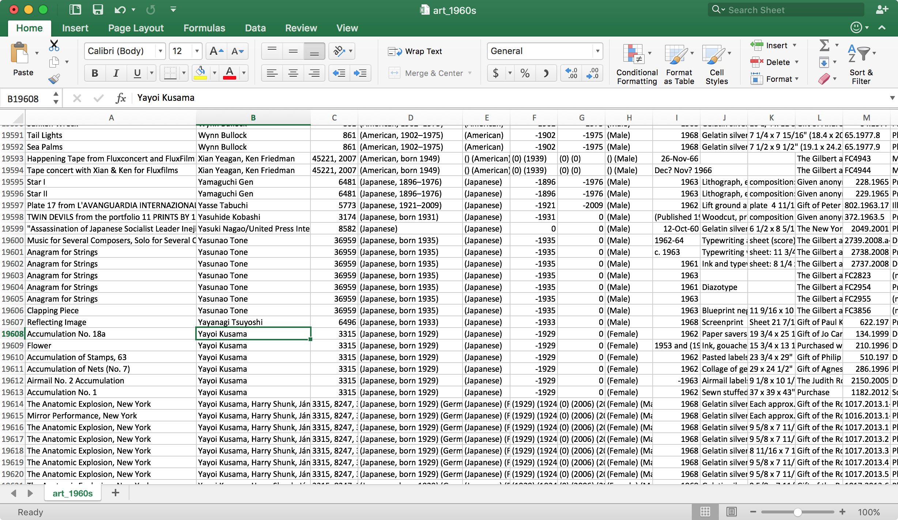
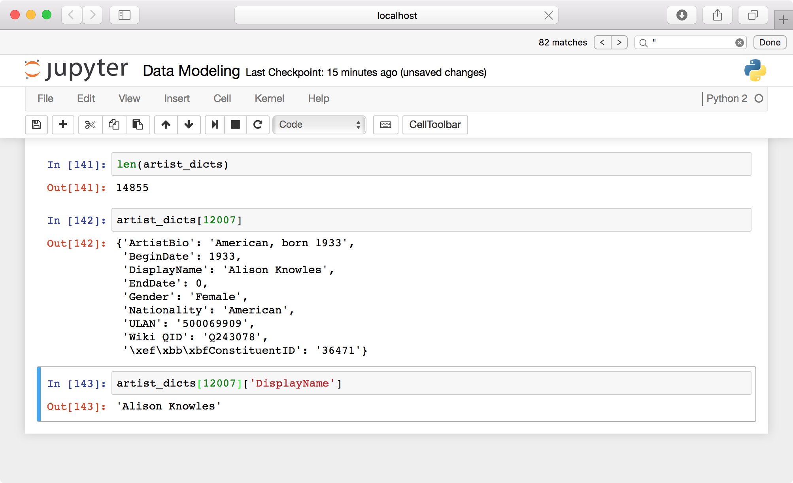

## Week 3 Outline: Data Modeling Outline

Enter your username to customize code snippets below: &nbsp;<input id="username" name="username" type="text" size=14 onKeyUp="findMyText(document.getElementById('username').value);">

Sample datasets from The Museum of Modern Art (MoMA) [via GitHub](https://github.com/MuseumofModernArt/collection). Download these files to your desktop.
- [Artists.csv](https://media.githubusercontent.com/media/MuseumofModernArt/collection/master/Artists.csv)
- [Artworks.csv](https://media.githubusercontent.com/media/MuseumofModernArt/collection/master/Artworks.csv)

## Topics to Cover
- Opening and editing CSV, JSON, and XML files in Python
- Sorting a table by key
	- [https://docs.python.org/2/howto/sorting.html#key-functions](https://docs.python.org/2/howto/sorting.html#key-functions)
- Discuss strengths and weaknesses of CSV, JSON, XML, and RDF models for various applications.
- Cleaning data using OpenRefine
	- Provide several data sets and work through OpenRefine tools as a class.

#### CSV I/O in Python
Paste the following code snippet into a new Jupyter notebook, then run the cell. We’ll go through it line by line in a moment.
	import csv
	
	csv_path="/Users/yourname/Desktop/Artists.csv"
	artist_table=[]
	
	o = open(csv_path,'rU')
	mydata = csv.reader(o)
	
	for row in mydata:
	     artist_table.append(row)
	
	o.close()
	
	artist_header=artist_table[0]
	artist_table.remove(artist_table[0])
	
	artist_header

Check the length of the table, then enter an index value in brackets to look at an entry.
	len(artist_table)
	artist_table[6310]

We’ve just copied all the data from a CSV-formatted spreadsheet and turned it into a format Python can easily work with: a list of lists of strings. Let’s walk through the above a step at a time, this time loading MoMa’s artwork metadata. 

We began by importing the `csv` module, Python’s built-in CSV input/output tool.
	import csv

Next we assign our pathname to the `artwork_path` variable and initialize an empty list called `artwork_table`. This will become our list of lists, Python’s version of a table.
	artwork_path="/Users/yourname/Desktop/Artworks.csv"
	artwork_table=[]

Then we create a file stream object `o` that points to our spreadsheet, including the argument `rU` to specify that we’ll be reading the file and expecting text. We pass our file object to `csv`’s constructor function and assign the new reader object to `mydata`.
	o = open(artwork_path,'rU')
	mydata = csv.reader(o)

Using a for loop, we iterate through our csv object and add each row (represented by a list) to the master list `meta_table`.
	for row in mydata:
		artwork_table.append(row)
	
	o.close()

Because this table uses column labels in the first row, we’ll save those labels to the variable `header` and remove it from the table.
	artwork_header=artwork_table[0]
	artwork_table.remove(artwork_table[0])

Finally, let’s look at our list of column titles …
	artwork_header

… as well as a row in our table.
	artwork_table[60946]

> **Tip:** Python will ignore any text following the “\\#” character on a line, which we can use to add explanatory comments within our code. Here are a couple lines from the snippet above followed by example notes. 
> 	header=meta_table[0] #saves list of column titles to variable 'header'
> 	meta_table.remove(meta_table[0]) #removes column titles from table
 
#### Quick Assignment
Write a piece of code that prints each column label in `artist_header` and `artwork_header` next to its index in the list, beginning from zero as usual. You may want to keep this reference handy for the next few exercises.

> _A possible solution:_
> 	print 'Artists\n'
> 	
> 	for i in  range(len(artist_header)):
> 	      print str(i)+' '+artist_header[i]
> 	
> 	print '\nArtworks\n'
> 	        
> 	for i in  range(len(artwork_header)):
> 	      print str(i)+' '+artwork_header[i]

#### Quick Assignment
Write a piece of code that creates a new table (i.e., list of lists) containing only artists born in the 1880s.

> _A possible solution:_
> 	born_1880s=[]
> 	 
> 	for row in artist_table:
> 	    if 1880<=int(row[5])<=1889:
> 	        born_1880s.append(row)

#### Average Artist Age
Now that we’ve defined a meaningful subset of our data, let’s see what we can do with it. For instance, what was the mean life span of artists born in the 1880s (that happen to be represented at MoMA)?

5 BeginDate
6 EndDate

	lifespans_1880s=[]
	
	for row in born_1880s:
	    lifespans_1880s.append(int(row[6])-int(row[5]))
	
	lifespans_1880s

If you scroll through your list of lifespans, you’ll see occasional negative numbers (e.g., “-1887”). Since missing values are represented by “0,” if no death date is listed we’ll end up subtracting an artist’s birth year from zero. Let’s amend our code to leave out these rows.
	lifespans_1880s=[]
	
	for row in born_1880s:
	    age=int(row[6])-int(row[5])
	    if age>0:
	        lifespans_1880s.append(age)
	
	lifespans_1880s

Now that we have a list of valid integers, all we need to do is calculate the mean. Below we divide the sum of the list (which we cast as a float) by its length to get 72.65 years.
	float(sum(lifespans_1880s)) / len(lifespans_1880s)

That format is a bit verbose for a simple task like this, so to make life easier we’ll use the Python package `NumPy`. Open a new terminal window and enter the following to install it.
	pip install -U --user numpy

Once it’s installed, switch back to Jupyter and try this alternative.
	import numpy
	numpy.mean(lifespans_1880s)
	
> **Tip:** The code above imports the entire `numpy` library. Python also lets us import libraries’ individual functions to the current environment, which can make code more compact.
> 	from numpy import mean
> 	mean(avg_lifespan_1880s)
> Another common convention is to rename `numpy` to `np` at the import step.
> 	import numpy as np
> 	np.mean(avg_lifespan_1880s)
> This guide will use to `numpy.mean()` for the sake of clarity, but feel free to set up your environment however you like.

#### Quick Assignment
Write a piece of code that creates a new table containing all artworks that include the term “Fluxus” in any metadata field.
> _A possible solution:_
> 	fluxus_table=[]
> 	
> 	for row in artwork_table:
> 	    for cell in row:
> 	        if 'fluxus' in cell.lower():
> 	            if row not in fluxus_table:
> 	                fluxus_table.append(row)

#### Fluxus Metadata Continued
Now let’s make a master list of entries under “medium” in our Fluxus metadata set.
	medium_list=[]
	for row in fluxus_table:
	    medium_list.append(row[9])
	
	len(medium_list)

Let’s look at 10 random samples from the collection, first importing the `sample()` function from `random`.
	from random import sample
	sample(medium_list,10)

Let’s see what terms appear most frequently in our list of media.
	from collections import Counter
	c = Counter(medium_list)
	c.most_common(10)

Note that 1605 artworks are missing an entry for “medium,” with the term “(CONFIRM)” appearing 99 times. 

#### Quick Assignment
Returning to our original MoMA metadata table, rite a piece of code that creates a extracts only works created in the 1960s (or another decade of your choosing). Since the date field in MoMA’s metadata doesn’t follow a strictly defined numerical format, you’ll have to think about how to interpret values like “1963,” “1963-5“, “c. 1963,” “c. 1960s,” etc.
> Let students struggle with this a bit, then encourage them to settle on a relatively quick and dirty solution. The collection doesn’t have to be perfect; we’ll be cleaning the table in OpenRefine later.

> _A simple solution with high recall and low precision:_
> 	art_1960s=[]
> 	for row in artwork_table:
> 	    if '196' in row[8]:
> 	        art_1960s.append(row)

> _A way-too-elaborate solution with better precision but imperfect recall:_
> 	import string
> 	
> 	def date_span(date_string):
> 	    if len(date_string)==0:return[-1,-1]
> 	    temp_string=date_string
> 	    if ', 1' in temp_string:
> 	        temp_string=date_string.split(',')[1]
> 	    elif ',' in temp_string:
> 	        temp_string=date_string.split(',')[0]
> 	    temp_string=temp_string.lower().replace('early ','').replace('late ','')
> 	    if (len(temp_string)>0)&(temp_string[0]!=['(']):
> 	        temp_string=temp_string.split('(')[0]
> 	    temp_string=temp_string.translate(None,"(){}<>[]; ")
> 	    try:
> 	        if 'c.' in temp_string:
> 	            temp_string=temp_string.replace('c.','').strip()
> 	        if temp_string.isdigit():
> 	            return [int(temp_string),int(temp_string)]
> 	        if temp_string[-2:]=='0s':
> 	            return [int(temp_string.strip('s')),int(temp_string.strip('s'))+9]
> 	        if '-' in temp_string:
> 	            pair=temp_string.split('-')
> 	            if len(pair[1].strip())==2:
> 	                return [int(pair[0].strip()),int(pair[0][:2]+pair[1].strip())]
> 	            elif len(pair[1])==4:
> 	                return [int(pair[0].strip()),int(pair[1].strip())]
> 	            else: print "error1: "+date_string + "-> " + temp_string
> 	    except: print "error2: "+date_string + " -> " + temp_string
> 	            
> 	art_temp=[]
> 	for row in artwork_table:
> 	    if '196' in row[8]:
> 	        art_temp.append(row)
> 	
> 	art_1960s=[]
> 	for row in art_temp:
> 	    years=date_span(row[8])
> 	    art_1960s.append(row)
> 	
> 	art_1960s[:15]
> Note that the code above is an example of a decision tree, the absolute simplest kind of “artificial intelligence” algorithm.

#### Sorting a Table by Column

We can sort a table based on the values in a given column with the `sorted` function and and the `itemgetter` tool, which we use to specify the column we’re sorting by. The following sorts the table `art_1960s` by artist name.
	from operator import itemgetter
	art_1960s_sorted=sorted(art_1960s, key=itemgetter(1))

Since each row is so long, let’s just look at our sorted set of authors. The following notation returns a list of  each row’s “Artist” cell, located at index 1.
	[row[1] for row in art_1960s_sorted]

Here we’re once again using the `Counter` constructor from the `collections` module.
	c=Counter([row[4] for row in art_1960s_sorted])
	c.most_common(20)

It’s impossible to memorize the details of every specialized tool available in Python, so you’ll probably end up repeatedly looking up processes like these.

#### Writing CSVs
Now that we’ve filtered and sorted our metadata, let’s export it to a new CSV file called `art_1960s.csv`.
	outpath="/Users/yourname/Desktop/art_1960s.csv"
	o = open(outpath, 'w')
	a = csv.writer(o)
	a.writerows([artwork_header])
	a.writerows(art_1960s_sorted)
	o.close()

Note that we call use `writerows` function twice, first writing the column headers and then the actual data. Because `writerows` only accepts lists of lists, we’ve enclosed the `header` list object in brackets to create a new list that only contains `header`.

Find the new file on your desktop and open it in Excel or Calc. Take a few moments to explore the collection.

#### The Dictionary Data Type
So far, when we want to access the “Artist” field in MoMA’s metadata, we’ve been referring to its position in a given row.
	row=art_1960s_sorted[7700]
	row[1]
> _Output:_
> 	'Helen Frankenthaler'

This system is straightforward and well-suited for many jobs, but for large, complex projects it can be difficult to keep track of all those index numbers. Instead, we can use a dictionary to reference metadata fields by name rather than list index.

Just like we can refer to a item in a list using brackets to enclose its position in the list, a dictionary, or dict, uses strings or numbers to identify each item in a collection. This data structure is known as a key-value pair. Here’s the simplest way to create a new dictionary.
	artist_meta={}
	artist_meta['\xef\xbb\xbfConstituentID']=248
	artist_meta['DisplayName']='Richard Avedon'
	artist_meta['ArtistBio']='American, 1923–2004'
	artist_meta['Nationality']='American'
	artist_meta['Gender']='Male'
	artist_meta['BeginDate']=1923
	artist_meta['EndDate']=2004
	artist_meta['Wiki QID']='Q305497'
	artist_meta['ULAN']='500013773'

The following is a more compact format for the same key-value assignment.
	artist_meta={'\xef\xbb\xbfConstituentID': 248, 'DisplayName': 'Richard Avedon', 'Gender': 'Male', 'BeginDate': 1923, 'EndDate': 2004, 'ULAN': '500013773', 'Wiki QID': 'Q305497', 'ArtistBio': 'American, 1923\xe2\x80\x932004', 'Nationality': 'American'}

To access a value, enter its key between brackets like so.
	artist_meta['DisplayName']

And note that you can iterate over a dict to view and/or use its keys.
	for key in artist_meta:
	     print key + " - " + str(artist_meta[key])  

Next, let’s create a dict for each artist MoMA’s artist metadata. Here’s a snippet (repeated from above) that loads `Artists.csv` as a list of lists called `artist_table`.
	import csv
	csv_path="/Users/yourname/Desktop/Artists.csv"
	artist_table=[]
	
	o = open(csv_path,'rU')
	mydata = csv.reader(o)
	for row in mydata:
	     artist_table.append(row)
	
	o.close()
	artist_header=artist_table[0]
	artist_table.remove(artist_table[0])

Now we’ll use a for loop to iterate through `artist_table`, converting each list of cells to key-value format.
	artist_dicts=[]
	
	for row in artist_table:
	    artist_meta={}
	    artist_meta['\xef\xbb\xbfConstituentID']=row[0]
	    artist_meta['DisplayName']=row[1]
	    artist_meta['ArtistBio']=row[2]
	    artist_meta['Nationality']=row[3]
	    artist_meta['Gender']=row[4]
	    artist_meta['BeginDate']=int(row[5])
	    artist_meta['EndDate']=int(row[6])
	    artist_meta['Wiki QID']=row[7]
	    artist_meta['ULAN']=row[8]
	    artist_dicts.append(artist_meta)   

The list `artist_dicts` should now contain records for about 15,000 artists.
	len(artist_dicts)

Specifying an index in brackets will return a dict object.
	artist_dicts[12007]

And we can use one of our standard key names to get a particular value.
	artist_dicts[12007]['DisplayName']

If we want to create a list of artist names, birth years, etc., we can thus iterate through the `artists_dicts` list and specify the field we want by name.

#### Working with JSON
JSON data is a representation of key-value pairs, very much like a dictionary in Python. For the following example we’ll download a JSON version of the artwork metadata we’ve been working with.

	import urllib2
	url="https://github.com/MuseumofModernArt/collection/blob/master/Artworks.json?raw=true"
	json_string=urllib2.urlopen(url).read()
	json_data = json.loads(json_string)

To view JSON data (as well as dictionaries and just about any other data format), Python offers a “pretty printer” module. There are also numerous online tools for prettifying JSON data, such as [these](http://jsonviewer.stack.hu/) [two](http://json.parser.online.fr/beta/).
	import pprint
	pprint.pprint(json_data)

To examine the top-level keys in our JSON data, enter the following.
	for key in json_data:
	        print key

> _Output_:
> 	records
> 	meta

In this case, the “records” key points to a list of item records. The following will return the first record.
	print json_data['records'][0]

> _Output_:
> 	{u'pk': 19579, u'model': u'collection.museumobject', u'fields': {u'primary_image_id': u'2006AJ6728', u'object': u'Cabinet', u'year_start': 1600, u'artist': u'Fiamengo, Iacopo', u'museum_number': u'W.36:1, 2-1981', u'rights': 3, u'object_number': u'O61539', u'last_processed': u'2016-04-30 02:11:57', u'event_text': u'', u'collection_code': u'FWK', u'place': u'Naples', u'longitude': u'14.25185000', u'last_checked': u'2016-04-30 02:11:57', u'museum_number_token': u'w361981', u'latitude': u'40.83990100', u'title': u'', u'date_text': u'about 1600 (Made)\nca. 1600 (made)', u'slug': u'cabinet-fiamengo-iacopo', u'sys_updated': u'2015-12-11 00:00:00', u'location': u'Europe 1600-1815, room 6, case CA11'}}

A record, in turn, contains three keys: “pk,” “model,” and “fields.”
	print json_data['records'][0]

> _Output:_
> 	pk
> 	model
> 	fields

The metadata we’re interested in is under “fields.” 
	for key in json_data['records'][0]['fields']:
	    print key

> _Output:_
> 	primary_image_id
> 	object
> 	year_start
> 	artist
> 	museum_number
> 	rights
> 	object_number
> 	last_processed
> 	event_text
> 	collection_code
> 	place
> 	longitude
> 	last_checked
> 	museum_number_token
> 	latitude
> 	title
> 	date_text
> 	slug
> 	sys_updated
> 	location

We can thus view the “artist” field like so.
	print json_data['records'][0]['fields']['artist']

#### JSON Data to CSV
Next we’ll transfer these metadata fields to CSV format. First, let’s create a list of column titles for reference:
	header=[]
	
	for key in json_data['records'][0]['fields']:
	    header.append(key)
	
	print header

Then we’ll use our column titles (which are also keys in the “fields” key-value set) to create a list of rows for our CSV. Since the CSV writer prefers working with non-Unicode strings, we’ll use the `str()` function to reformat each metadata item as we add it to the table.
	meta_table=[]
	
	for record in json_data['records']:
	    row=[]
	    for key in header:
	        row.append(unidecode(record['fields'][key]))
	    meta_table.append(row)
	
	print meta_table[0]

Now let’s make a string version of our header.
	header_string=[]
	
	for item in header:
	    header_string.append(str(item))

Finally, we’ll write our metadata collection as a CSV.
	import csv
	outpath="/Users/yourname/Desktop/V_and_A_ivory.csv"
	o = open(outpath, 'w')
	a = csv.writer(o)
	a.writerows([header_string])
	a.writerows(meta_table)
	o.close()

Open your CSV in Excel or Calc and marvel at your 

#### OpenRefine
Launch the OpenRefine application and enter the following in your browser’s URL bar to access the interface.
- [http://127.0.0.1:3333/](http://127.0.0.1:3333/)

Click “Create Project” then “Choose Files” and choose “V\_and\_A\_ivory.csv.” Click “Next.” In the following window, click “Create Project” in the upper right corner.

At the top of the “place” column, click the dropdown button and choose “Text Facet.” A list of places will appear in the left column. Click “Paris” to display only works created there.

Note that several “place” records are listed as “Germany,” while others are German cities. Let’s group them under a single facet.

> More coming soon.

#### Discussion 
Talk about strengths and weaknesses of CSV, JSON, XML, and RDF models for various applications.